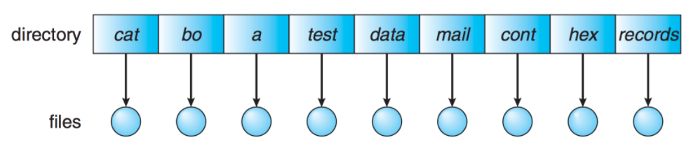
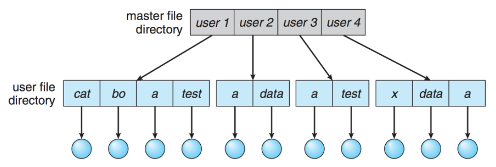
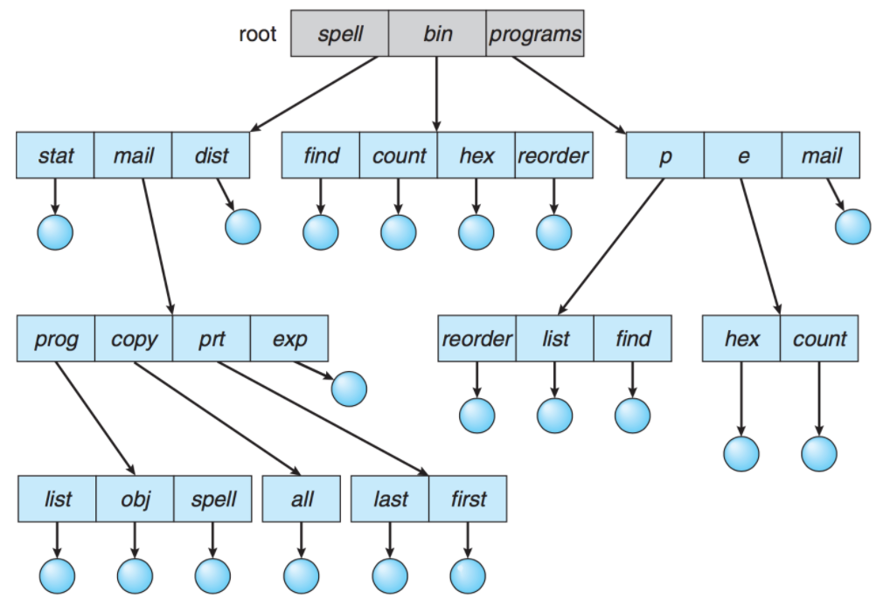
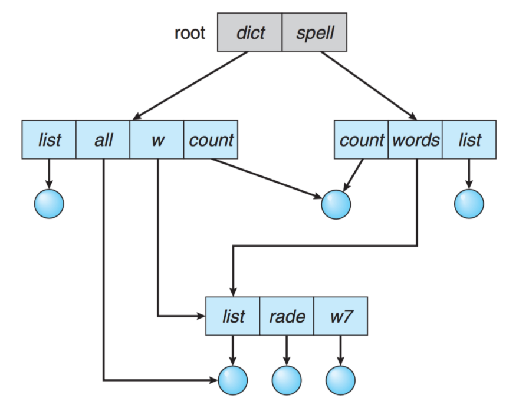
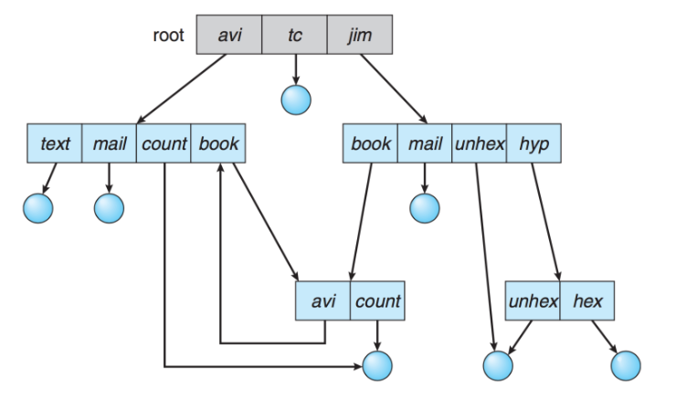
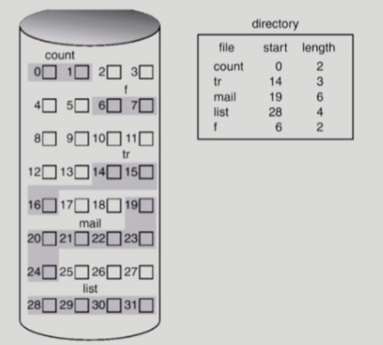
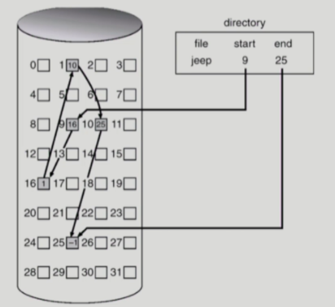
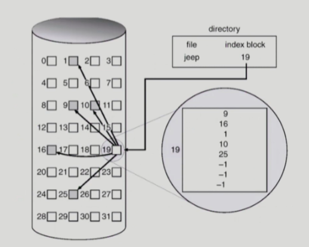

# 파일 시스템

## File and File System

#### 파일

- 논리적인 저장 단위
- 관련된 정보 자료들의 집합에 이름을 붙인 것
- 컴퓨터 시스템의 편리한 사용을 위해 정보 저장의 일괄된 논리적 관점 제공
- 일반적으로 레코드 혹은 블록 단위로 비휘발성 보조기억장치에 저장됨

#### 파일 속성 (= 메타데이터)

- 파일을 관리하기 위한 각종 정보들
- 파일 자체의 내용은 아님
- 파일 이름, 유형, 저장된 위치, 파일 사이즈, 접근 권한, 소유자, 시간 등 파일에 대한 전반적인 정보

#### 파일 시스템

- OS와 모든 데이터, 프로그램의 저장과 접근을 위한 기법을 제공
- 시스템 내의 모든 파일에 관한 정보를 제공하는 계층적 디렉터리 구조
- 파일 및 파일의 메타데이터, 디렉터리 정보 등을 관리

#### 파티션

- 연속된 저장 공간을 하나 이상의 연속되고 독립적인 영열으로 나누어 사용할 수 있도록 정의한 규약
- 하나의 물리적 디스크 안에 여러 파티션을 두는 게 일반적
- 여러 물리적 디스크를 하나의 파티션으로 구성하기도 함

## Access Methods

### 1. 순차 접근 (Sequential Access)

- 파일의 정보가 레코드 순서대로 처리된다.
- 가장 단순한 방법
- 카세트테이프를 사용하는 방식과 동일
- 현재 위치에서 읽거나 쓰면 offset이 자동으로 증가하고, 뒤로 돌아가기 위해선 되감기가 필요하다.

### 2. 직접 접근 (Random Access)

- 파일의 레코드를 임의의 순서로 접근할 수 있다.
- LP 판을 사용하는 방식과 동일
- 읽기나 쓰기의 순서에 제약이 없으며 현재 위치를 유지할 수 있다면 이를 통해 순차 접근 기능도 구현 가능

### 3. 색인 접근 (Index Access)

- 파일에서 레코드를 찾기 위해 색인을 먼저 찾고 대응되는 포인터를 얻는다.
- 이를 통해 파일에 직접 접근하여 원하는 데이터를 얻을 수 있다.
- 크기가 큰 파일에서 유용

## Directory

- 파일의 메타데이터 중 일부를 보관하고 있는 일종의 특별한 파일
- 해당 디렉터리에 속한 파일 이름과 속성들을 포함
- 기능
  - 파일 찾기/생성/삭제
  - 디렉터리 나열
  - 파일 재명명
  - 파일 시스템 순회

### 1. 1단계 디렉터리 (Single-Level Directory)

- 모든 파일들이 디렉터리 밑에 존재하는 형태
- 파일들은 서로 유일한 이름을 가지고 서로 다른 사용자라도 같은 이름을 사용할 수 없다.
- 장점
  - 지원이 쉽고 이해가 쉽다.
- 단점
  - 파일이 많아지거나 다수의 사용자가 존재하는 시스템에서는 심각한 제약을 갖는다.

### 2. 2단계 디렉터리 (Two-Level Directory)

- 각 사용자별로 별도의 디렉터리를 갖는 형태
- 장점
  - 서로 다른 사용자가 같은 이름의 파일을 가질 수 있음
  - 효율적인 탐색 가능
- 단점
  - 그룹화 불가능
  - 다른 사용자의 파일에 접근해야 하는 경우에는 단점이 됨

### 3. 트리 구조 디렉터리 (Tree-Structured Directory)

- 사용자들이 자신의 서브 디렉터리를 만들어서 파일을 구성할 수 있는 형태
- 하나의 루트 디렉터리를 가지며 모든 파일은 고유한 경로(절대 경로/상대 경로)를 가진다.
- 장점
  - 효율적인 탐색 가능
  - 그룹화 가능
- 디렉터리는 일종의 파일이므로 일반 파일인지 디렉터리인지 구분이 필요
  - bit를 사용하여 0이면 일반 파일, 1이면 디렉터리로 구분

### 4. 비순환 그래프 디렉터리 (Acyclic-Graph Directory)

- 디렉터리들이 서브 디렉터리들과 파일을 공유할 수 있도록 하는 형태
- 트리 구조의 디렉터리를 일반화한 형태
- 단순한 트리 구조보다는 더 복잡한 구조이기 때문에 몇몇 문제 발생 가능
- 파일을 무작정 삭제하면 현재 파일을 가리키는 포인터는 대상이 사라지게 된다.
- 따라서 참조되는 파일에 참조 계수를 두어서, 참조 계수가 0이 되면 파일을 참조하는 링크가 존재하지 않는다는 의미이므로 그때 파일을 삭제한다.

### 5. 일반 그래프 디렉터리 (General Graph Directory)

- 순환을 허용하는 그래프 구조
- 순환이 허용되면 무한 루프에 빠질 수 있다.
- 따라서 하위 디렉터리가 아닌 파일에 대한 링크만 허용하거나 garbase collection을 통해 전체 파일 시스템을 순회하고 접근 가능한 모든 것을 표시한다.

## 파일 데이터를 디스크에 할당하는 방법

### 1. 연속 할당 (Contiguous Allocation)

- 파일을 디스크에 연속되게 저장하는 방식
- 디렉터리에 파일이 시작 부분의 위치와 파일의 길이에 대한 정보를 저장하면 전체를 탐색할 수 있다.
- 장점
  - 연속적으로 저장되어 있으므로 한 번의 탐색으로 많은 양 전송 가능
  - Random Access 가능
- 단점
  - 외부 단편화 발생
  - 파일의 크기를 키우기 어렵
    - 파일의 커질 가능성을 고려해서 미리 큰 공간을 할당하면 내부 단편화 발생 가능

### 2. 연결 할당 (Linked Allocation)

- 연속적으로 할당하지 않고 빈 위치면 자유롭게 할당하는 방식
- 다음 읽어야 할 위치를 연결 리스트처럼 포인터로 가리킨다.
- 디렉터리에는 파일이 시작하는 위치와 끝나는 위치만 저장된다.
- 장점
  - 외부 단편화 발생하지 않음
- 단점
  - Random Access 불가능
  - 포인터를 위한 공간이 block의 일부가 되어 공간 효율성 감소
  - 한 sector가 고장나 포인터가 유실되면 많은 부분을 잃는 신뢰성 문제
- 단점을 보완하기 위해 **FAT**(**File-Allocation-Table**)이라는 파일 시스템 사용
  - 포인터를 별도의 위치에 보관하여 신뢰성 문제와 공간 효율성 문제를 해결

### 3. 색인 할당 (Indexed Allocation)

- 한 블록에 하나의 파일에 대한 데이터의 index들을 모두 저장하는 방식
- 디렉터리에는 해당 블록의 위치만 담음
- 장점
  - 외부 단편화 발생하지 않음
  - Random Access 가능
- 단점
  - 작은 파일인 경우, 위치를 저장하는 블록 공간 낭비
  - 너무 큰 파일인 경우, 하나의 블록으로 파일의 index들을 모두 저장하기에 부족

