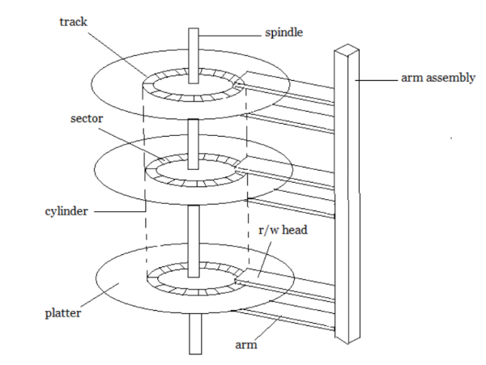
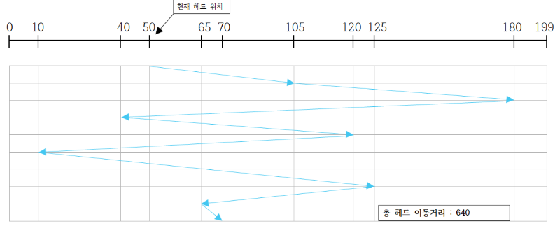
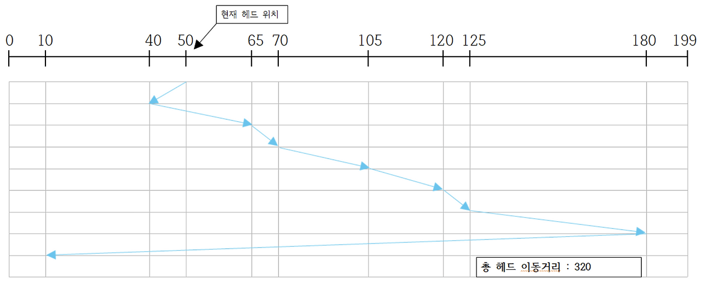
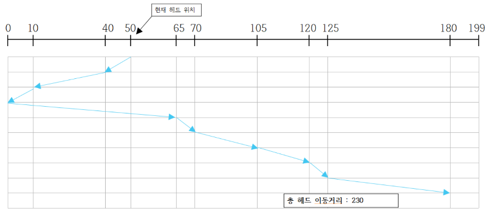
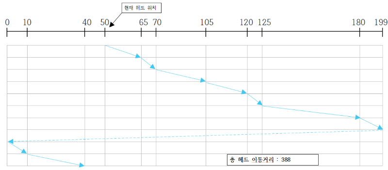

# 디스크 관리

## 디스크 구조

#### 논리 블록 (Logical Block)

- 디스크의 외부에서는 디스크를 일정한 크기의 저장 공간들로 이루어진 1차원 배열처럼 취급한다.
- 이때 일정한 크기의 저장 공간들을 **논리 블록**이라 한다.
- 디스크에 데이터가 저장될 때에는 논리 블록 단위로 저장되고, 디스크 외부로 입출력이 일어날 때도 논리 블록 단위로 전송된다.

#### 논리 블록에 저장된 데이터에 접근하는 방법

- 배열에 접근하려는 것처럼 해당 블록의 인덱스 번호를 디스크에 전달함으로서 접근할 수 있다.
- 이때 디스크 컨트롤러는 해당 논리 블록이 저장된 물리적/위치적 위치를 찾아 요청된 데이터에 대한 입출력 작업을 수행하게 된다.

#### 섹터 (Sector)

- 각 논리 블록이 저장되는 디스크 내의 물리적인 위치
- 논리 블록 하나가 섹터 하나와 1:1 매핑되어 저장됨

#### 마크네틱의 원판 (Platter)

- 디스크의 물리적 구조는 플래터로 구성됨
- 하나의 디스크 내의 원판 수는 하나 이상이다.
- 이때 각각의 원판은 **트랙**으로 구성되고, 이 트랙은 **섹터**로 구성되어 있다.

#### 실린더 (Cylinder)

- 여러 개의 원판에서 상대적인 위치가 동일한 트랙들의 집합
- 디스크에 데이터를 읽고 쓰기 위해서는 **Arm**이 해당 섹터가 위치한 실린터로 이동한 후 원판이 회전하여 디스크 헤드가 저장된 섹터 위치에 도달해야 한다.

## 디스크에 대한 접근 시간

- 디스크 입출력의 효율을 높이기 위해서는 디스크 입출력에 소요되는 접근 시간을 최소화해야 한다.
- 회전 지연 시간과 전송 시간은 상대적인 수치가 작을 뿐 아니라 OS 입장에서 통제하기 힘들다.  
  => OS는 탐색 시간을 줄이기 위해 헤드의 움직임을 최소화하는 스케줄링 작업을 진행한다.

### 1. 탐색 시간 (Seek Time)

    디스크 헤드를 해당 실린더 위치로 이동시키는데 걸리는 시간

### 2. 회전 지연 시간 (Rotational Latency Time)

    디스크가 회전해서 읽고 쓰로는 섹터가 헤드 위치에 도달하기까지 걸리는 시간

### 3. 전송 시간 (Transfer Time)

    해당 섹터가 헤드 위치에 도달한 후 데이터를 실제로 섹터에 읽고 쓰는데 소요되는 시간

## 디스크 스케줄링 기법

- 효율적인 디스크 입출력을 위해 여러 섹터들에 대한 입출력 요청이 들어왔을 때 이들을 어떠한 순서로 처리할지 결정하는 메커니즘
- 목적: 디스크 헤드의 이동 시간을 줄이는 것

### 1. FCFS 스케줄링

- 디스크에 먼저 들어온 요청을 먼저 처리하는 방식
- 최악의 경우, 만약 입출력 요청이 디스크의 한쪽 끝과 반대쪽 끝에 번갈아 도착한다면, 디스크는 계속 왕복하며 일을 처리해야 한다. (매우 긴 탐색 시간)

### 2. SSTF (Shortest Seek Time First)

- 헤드의 현재 위치로부터 가장 가까운 위치에 있는 요청을 제일 먼저 처리하는 방식
- 헤드의 이동거리를 줄여 디스크 입출력의 효율성을 증가시키지만, 기아 현상이 발생 가능하다.
  - 현재 헤드 위치로부터 가까운 곳에서 지속적인 요청이 들어올 경우, 헤드 위치에서 멀리 떨어진 곳의 요청은 무한히 기다려야 하는 문제

### 3. SCAN 알고리즘

- 헤드가 디스크 원판의 안쪽 끝과 바깥쪽 끝을 오가며 그 경로에 존재하는 모든 요청을 처리하는 방식
- 디스크의 어떠한 위치에 요청이 들어오는가와 상관없이 헤드는 정해진 방향으로 이동하면서 길목에 있는 요청들을 처리하며 지나가는 것
- 효율성과 형평성 모두 만족
  - FCFS처럼 불필요한 헤드의 이동이 발생하거나, SSTF처럼 일부 지역에 오래 기다리는 현상이 발생하지 않는다.
- 하지만 모든 실린더 위치의 기다리는 시간이 공평한 것은 아님
  - 제일 안쪽이나 제일 바깥쪽 위치보다는 가운데 위치가 기다리는 평균 시간이 더 짧음

### 4. C-SCAN 알고리즘

- SCAN처럼 헤드가 한쪽 끝에서 다른쪽 끝으로 이동하며 가는 길목에 있는 모든 요청 처리
- SCAN과 달리 헤드가 다른 쪽 끝으로 도달해 방향을 바꾼 후에는 요청을 처리하지 않고 곧바로 출발점으로 다시 이동한다.
- SCAN보다 좀 더 균일한 탐색 시간 제공

### 5. LOOK과 C-LOOK 알고리즘

- 헤드가 한 쪽 방향으로 이동하다가 그 방향에 더 이상 대기 중인 요청이 없으면 헤드의 이동 방향을 즉시 반대로 바꾸는 스케줄링 방식
- C-LOOK은 C-SCAN과 같이 한쪽 방향으로 이동할 때만 요청 처리

## 다중 디스크 환경에서의 스케줄링

- 동일한 정보를 여러 디스크에 중복 저장
- => 인기 있는 데이터를 여러 디스크로부터 동시에 서비스
- => 일부 디스크에 오류가 발생해도 지속적인 서비스 가능
- => 정보의 유실 방지
- 앞의 스케줄링 기법들은 하나의 디스크 내에서 입출력 요청의 처리 순서를 결정하는 것이라면, 다중 디스크에서의 스케줄링은 작업을 수행할 디스크를 결정한 문제까지 포함
  - 디스크 간의 부하 균형(load balancing)을 이루도록 스케줄링하는 것이 중요

## Swap-space Management

- 가상 메모리 시스템에서는 디스크를 메모리의 연장 공간으로 사용
- 파일 시스템 내부에 둘 수도 있으나 별도 파티션을 사용하는 것이 일반적
- 공간 효율성보다는 속도 효율성이 우선
- 일반 파일보다 훨씬 짧은 시간만 존재하고 자주 참조됨
- block 크기 및 저장 방식이 일반 파일 시스템과 다름
- seek time을 줄이기 위해서 굉장히 큰 단위로 swap 데이터를 할당

## RAID (Redundant Array of Independent Disks)

- 여러 개 디스크를 묶어서 사용
- 장점
  - 디스크 처리 속도 향상
    - 여러 디스크에 block 내용 분산 저장 -> 병렬적으로 읽어옴
  - 신뢰성 향상
    - 동일한 정보를 여러 디스크에 중복 저장
    - 하나의 디스크가 고장 시 다른 디스크에서 읽어옴
    - 일부 디스크에 패리티를 저장하여 공간의 효율성 증가
