# 01-Operating System

운영체제는 컴퓨터 하드웨어 바로 위에 설치되는 소프트웨어 계층으로서 모든 컴퓨터 시스템의 필수적인 부분이다.

본 강좌에서는 이와 같은 운영체제의 개념과 역할, 운영체제를 구성하는 각 요소 및 그 알고리즘의 핵심적인 부분에 대해 기초부터 학습한다.

- [01-Operating System](#01-operating-system)
  - [운영체제란?](#운영체제란)
    - [운영체제의 목적](#운영체제의-목적)
    - [운영체제의 기능](#운영체제의-기능)
    - [프로세스의 상태](#프로세스의-상태)
  - [CPU 스케줄링](#cpu-스케줄링)
    - [FCFS (First-Come First-Served)](#fcfs-first-come-first-served)
    - [SJF (Shortest-Job-First)](#sjf-shortest-job-first)
    - [RR (Round Robin)](#rr-round-robin)
  - [메모리 관리](#메모리-관리)
    - [LRU vs LFU](#lru-vs-lfu)
  - [디스크 스케줄링](#디스크-스케줄링)
    - [FCFS (First-Come First-Served)](#fcfs-first-come-first-served-1)
    - [SSTF (Shortest Seek Time First)](#sstf-shortest-seek-time-first)
    - [SCAN](#scan)
  - [저장장치 계층구조와 캐싱(caching)](#저장장치-계층구조와-캐싱caching)
    - [플래시메모리](#플래시메모리)
  - [운영체제의 종류](#운영체제의-종류)

## 운영체제란?

OS; Operating System

컴퓨터 하드웨어 바로 위에 설치되어 사용자 및 다른 소프트웨어와 하드웨어를 연결하는 소프트웨어 계층

직접 하드웨어를 관리해주는 소프트웨어

굉장히 까다로운 소프트웨어

### 운영체제의 목적

컴퓨터 시스템을 **편리하게 사용할 수 있는 환경을 제공**

- 운영체제는 동시 사용자/프로그램들이 각각 독자적 컴퓨터에서 수행되는 것 같은 illusion을 제공
- 하드웨어를 직접 다루는 복잡한 부분을 운영체제가 대행
- Physical Machine을 Server의 개념으로 생각하면 좋을듯
    
    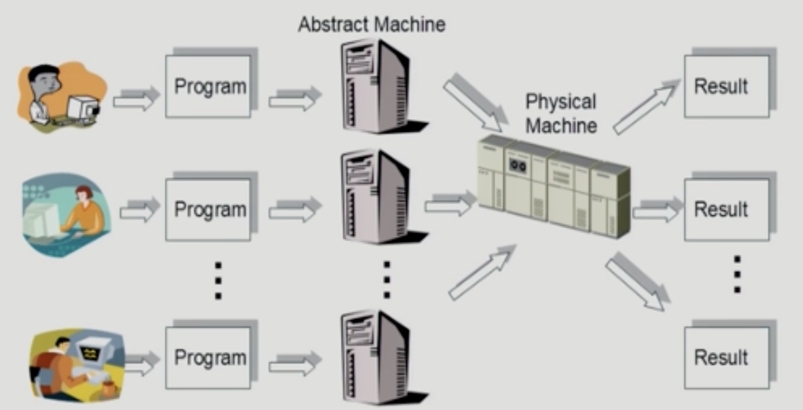
    

⭐ 컴퓨터 시스템의 **자원(CPU, Memory)을 효율적으로 관리**

- CPU, 메모리, I/O 장치 등의 효율적 관리
    - 주어진 자원으로 최대한의 성능을 내도록 → 효율성
    - 특정 사용자/프로그램의 지나친 불이익이 발생하지 않도록 → 형평성
- 사용자 및 운영체제 자신의 보호

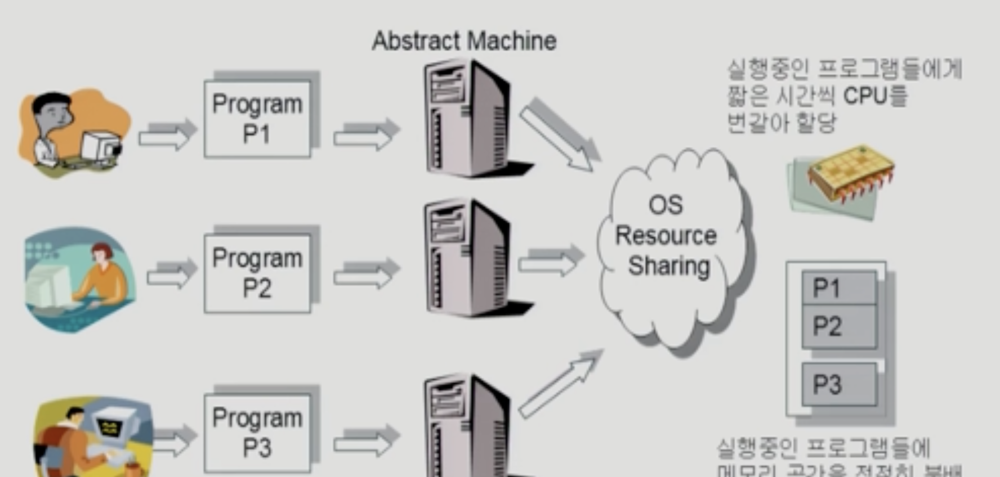

메모리: CPU의 작업공간

여러 프로그램을 동시에 실행시킬 경우, 메모리가 다 소진될 수 있음

하드 디스크에서 필요한 부분만 D램에 올려 실행 → 어떤 프로그램에 메모리 용량을 얼마나 할당할 것인가?

### 운영체제의 기능
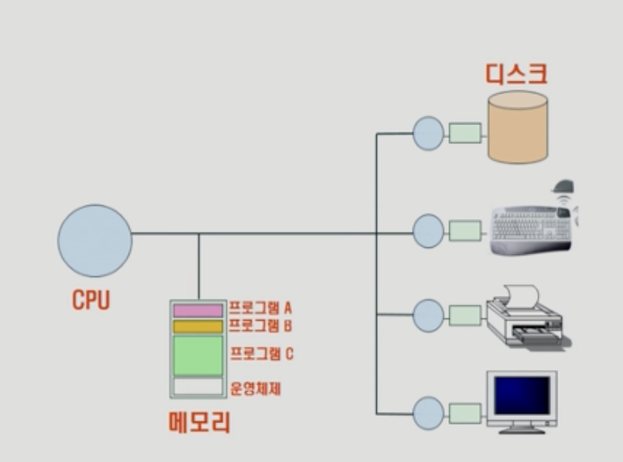

운영체제가 메모리 위에 올라가서 실행이 됨

운영체제는 컴퓨터가 꺼지기 전까지 항상 실행되는 프로그램

커널: 메모리에 상주

CPU가 직접 I/O 디바이스에 접근하지 않음

CPU → I/O 컨트롤러에 요청

**CPU 스케줄링**

어떤 프로그램에게 CPU 사용권을 줄 것인지

CPU는 하드웨어이므로 직접 결정 불가

운영체제가 각 프로그램에게 CPU 사용권 결정 후 넘김

**메모리 관리**

한정된 메모리를 어떻게 쪼개어 쓰지?

**디스크 스케줄링**

디스크에 들어온 요청을 어떤 순서로 처리할까?

요청이 들어온 순서대로 처리하면 비효율적

엘리베이터 스케줄링(비슷)

**인터럽트, 캐싱**

빠른 CPU와 느린 I/O 장치간 속도차를 극복

캐싱:  메모리와 디스크의 속도차이가 있음. 추후 같은 데이터를 요청할 것을 대비하여 디스크에 있는 데이터를 메모리에 저장하여, 훨씬 빠르게 데이터 전송

인터럽트(가로채기): CPU에서 프로그램A를 진행하다, 컨트롤러(디스크, I/O장치)에 요청을 보내고 무엇을 하지? → 놀고 있는 것x, 다른 프로그램B진행 → 컨트롤러가 작업 완료 → 인터럽트를 통해 CPU에게 알려줌 → 프로그램A 진행

인터럽트가 들어오면 자동적으로 운영체제에 CPU가 넘어감

### 프로세스의 상태

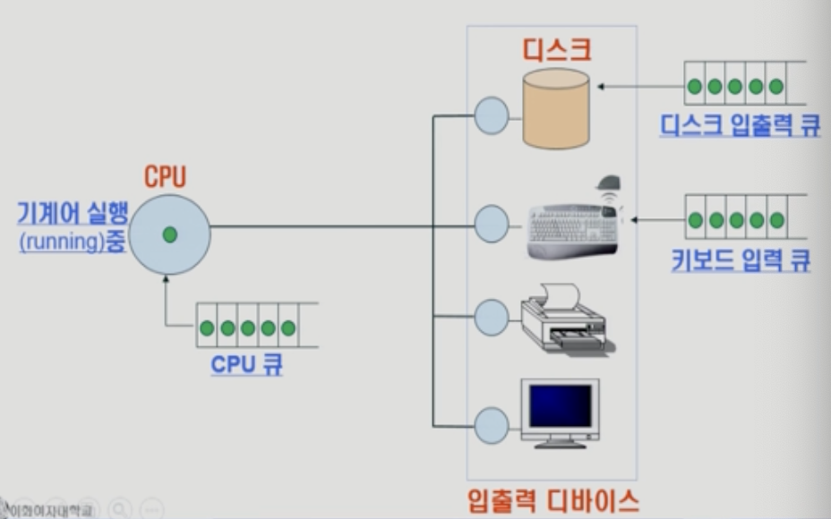

어떤 프로그램이 CPU에서 진행 중이다가 시간이 오래걸리면 CPU 큐로 넘겨서 기다리게 함

디스크 큐도 동일

## CPU 스케줄링

도착순서는 0초로 비슷하나 간발의 차이로 P1이 앞선다고 가정

원하는 만큼의 CPU 사용 → I/O 사용 순서로 진행

### FCFS (First-Come First-Served)

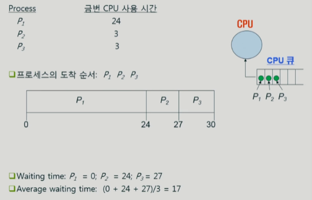

먼저 온 순서대로 CPU 사용할 수 있도록 하는 알고리즘

공평해보이나, 효율적이지 않음

기다리는 시간 Waiting time이 비효율

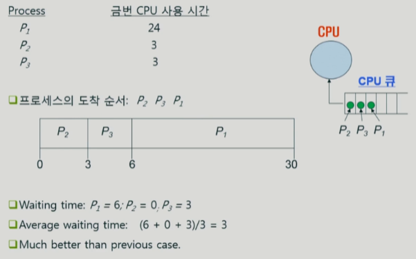

P2가 먼저 올 경우 Average waiting time이 줄어들음

### SJF (Shortest-Job-First)

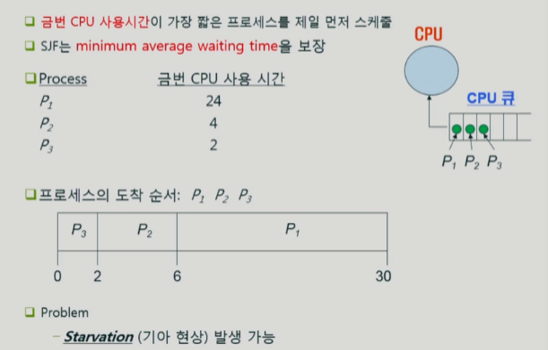

프로세스 중에 CPU 사용시간이 가장 짧은 프로세스를 먼저 스케줄

평균대기시간 측면에서는 가장 optimal함

**Starvation**

형평성의 문제가 발생

CPU를 길게 써야하는 프로세스가 무한히 대기해야 하는 상황 발생

### RR (Round Robin)

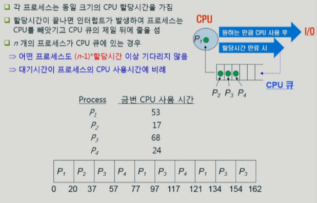

현재 가장 많이 사용하는 CPU 스케줄링

CPU를 길게 사용하는 프로그램은 할당시간 만큼을 반복

인터럽트를 발생시켜 CPU큐에 있게 함

프로세스가 CPU를 사용하려는 양만큼 기다리게 함

## 메모리 관리

프로그램이 실행할 때 본인만의 가상 메모리 형성

→ 실제 물리적인 메모리에는 각 프로세스에게 당장 필요한 부분만 올라감

→ 메모리에 새로운 프로세스가 올라갈 경우, 기존 프로세스는 디스크의 스왐영역에 보관

**디스크의 분류**

스왑영역: 메모리의 연장 공간

파일시스템: 비휘발성 영역

### LRU vs LFU

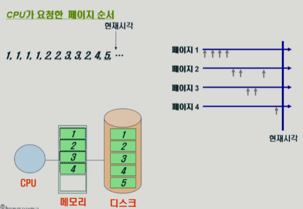

페이지: 프로세스의 쪼개지는 단위

메모리가 꽉 찬 뒤에, 5번 페이지가 요청됨

**운영체제는 어떤 페이지를 쫓아낼까**? → 효율성을 가장 먼저 생각

쫓겨난 친구가 다음번에 요청된다면 굉장히 손해

미래에 다시 사용될 가능성이 높은 페이지는 쫓아내지 않고, 가능성이 낮은 페이지를 쫓아내야 함

**현재시각 5번 페이지를 보관하기 위해 어떤 페이지를 삭제해야 하는가?**

LPU(가장 오래 전에 참조한 페이지 삭제): 페이지1 삭제

LFU(참조횟수가 가장 적은 페이지 삭제): 페이지 4 삭제

메모리 관리를 굉장히 빨리 결정해야 함

## 디스크 스케줄링

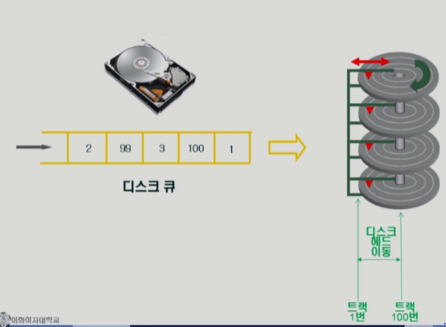

디스크헤드(빨강 세모)가 이동하면서 각 디스크의 트랙을 읽음

디스크 큐에 1 → 100 → 3 → 99 순서라면 디스크헤드가

트랙1번 → 트랙 100번 → 트랙 3번 순서로 이동해야 하는가? → 비효율

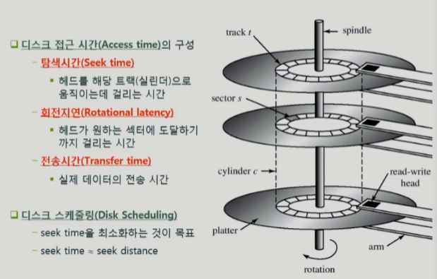

**탐색시간(Seek time)**

디스크 헤드가 이동하는 시간

가장 많은 시간이 소요됨

디스크 스케줄링의 목표

**회전지연(Rotational latency)**

탐색시간 다음으로 많은 시간 소요

트랙 내에 헤드가 읽길 원하는 섹터에 도달하기까지 걸린 시간

### FCFS (First-Come First-Served)

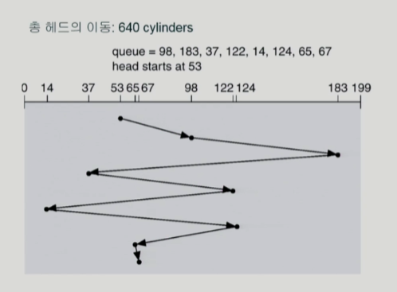

### SSTF (Shortest Seek Time First)

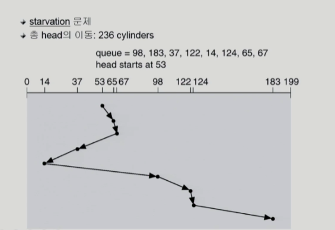

가장 가까운 트랙으로 이동

이동거리를 짧게 하기 위함

**starvation**문제 발생

### SCAN

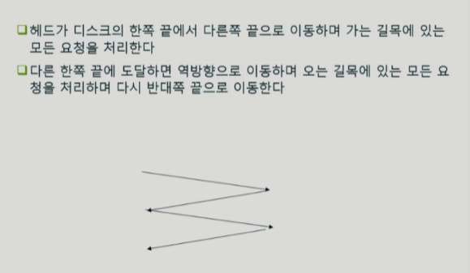

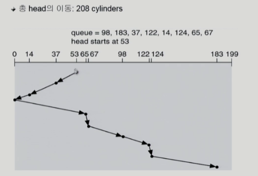

디스크 스케줄링에서 가장 많이 쓰이는 방법

헤드가 일방향으로 이동하면서 요청 들어오는 것을 처리 → 방향을 바꿔서 요청 들어오는 것 처리

엘리베이터 스케줄링과 동일함

## 저장장치 계층구조와 캐싱(caching)

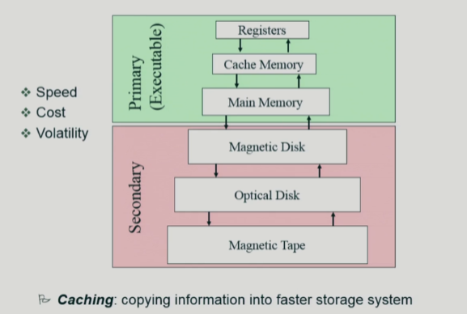

맨 위에 CPU 존재 → Main Memory → Disk

Cach Memory: Register와 Main Memory의 속도 차이를 완충하기 위함

요즘은 Disk위에 Flash Memory를 사용하는 경향이 있음

Secondary 계층은 조금씩 달라지고 있음

계층의 위로 올라갈 수록 빠름

가격도 위쪽이 비쌈, 적은 용량만 사용 가능

**Volatility(휘발성)**

Secondary: 전원을 꺼도 내용 유지, I/O 장치로 구성되어 있음

Primary(메인 메모리): 전원을 끄면 내용 휘발

**시간 완충 → Caching**

빠른 계층으로 복사를 미리 해놓고, 위 계층에서 요청할 시 복사한 메모리를 전달. 가장 아래 계층까지 내려갈 필요가 없음

### 플래시메모리

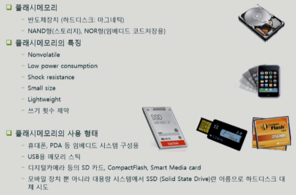

우리가 사용하는 플래시메모리는 거의 NAND형임

**장점**

비휘발성

전력 소모가 적음

물리적인 충격에 보다 강함(하드디스크에 비해)

**단점**

쓰기 횟수 제약이 있음

데이터가 시간이 흐르면 변질될 가능성 有

→ 셀 안의 전하의 양으로 0과 1를 구분함. 시간이 흐르면 전하의 양이 감소해 데이터가 변질될 수 있음

→ 하드웨어적인 약점을 소프트웨어가 보완해야 함

## 운영체제의 종류

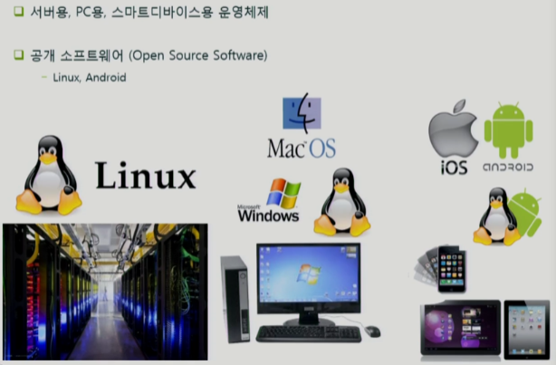

서버용, PC용, 스마트디바이스용 운영체제로 나뉨

- 서버 - Linux

- PC - Windows, Linux, IOS

Android도 맨 밑 커널에는 Linux 존재

**공개 소프트웨어 (Open Source Software)**

- Linux, Android

비공개: 코드를 컴파일 후 binary 형태로 파는 것

소프트웨어 시장은 독점 체제가 용이

인건비 외의 값이 들지 않는 특성 상, 독점을 하지 못한 소프트웨어는 소스를 오픈해버리는 경우가 있음