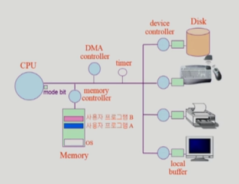
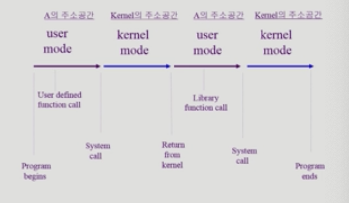

# 02-System Structure & Program Execution
## 컴퓨터 시스템 구조

- device controller: I/O 장치를 관리하는 작은 CPU
- local buffer: 각각의 controller가 가지고 있는 작업 공간
- CPU: 기계어를 연산
- 운영체제가 CPU를 사용자 프로그램에게 넘겨줄 때 어떤 일이 일어날 지 예상할 수 없음 = 운영체제가 제어할 수 없음
- CPU는 매순간 Interrupt line을 확인함
    
    → 코딩할때 Keyboard Interrupt 확인해본 적 있음.

- Interrupt는 I/O장치가 발생시킴

**program counter register (Register PC)**

- 메모리 주소를 가지고 있음
- 가리키는 프로그램이 CPU에서 실행중인 것임
- 프로그램A가 무한루프를 돌아서 CPU를 내놓지 않음
- 운영체제 혼자서 CPU를 뺏어올 수 없음
- 부가적인 하드웨어 timer가 필요
  
## Mode bit

CPU에서 기계어를 실행할 때 운영체제인지, 사용자 프로그램인지를 구분하는 것

사용자 프로그램의 잘못된 수행으로 다른 프로그램 및 운영체제에 피해가 가지 않도록 하기 위한 보호 장치 필요

Mode bit을 통해 하드웨어적으로 두 가지 모드의 operation 지원

**1 사용자 모드**: 사용자 프로그램 수행

**0 모니터 모드***: OS 코드 수행

- 보안을 해칠 수 있는 중요한 명령어는 모니터 모드에서만 수행 가능한 ‘특권명령’으로 규정
- Interrupt나 Exception 발생시 하드웨어가 mode bit을 0으로 바꿈
- 사용자 프로그램에게 CPU를 넘기기 전에 mode bit을 1로 셋팅

mode bit이 0으로 바뀌면 운영체제에게 CPU가 넘어감

모니터 모드 = 커널 모드, 시스템 모드

## Timer

정해진 시간이 흐른 뒤 운영체제에게 제어권이 넘어가도록 인터럽트를 발생시킴

타이머는 매 클럭 틱 때마다 1씩 감소

타이머 값이 0이 되면 타이머 인터럽트 발생

CPU를 특정 프로그램이 독점하는 것으로부터 보호

타이머는 time sharing을 구현하기 위해 널리 이용됨

타이머는 현재 시간을 계산하기 위해서도 사용

**Clock(클럭)**

CPU의 속도와 관련된 단위(Hz)

CPU는 일정한 박자에 맞춰 작업을 수행하는데, 이 박자를 만들어내는 것이 클럭임

**Clock Cycle (=Clock Tik)**

일정한 속도를 가지고 동작하는 프로세서의 **클럭 한 주기** 동안의 시간

거의 모든 컴퓨터는 하드웨어 이벤트가 발생하는 시점을 결정하는 클럭을 이용하여 만들어짐

## 인터럽트 (Interrupt)

인터럽트 당한 시점의 레지스터와 program counter를 저장한 후 CPU의 제어를 인터럽트 처리 루틴에 넘긴다

### Interrupt의 의미
  - Interrupt(하드웨어 인터럽트): 하드웨어가 발생시킨 인터럽트
  - Trap(소프트웨어 인터럽트)
    - Exception: 프로그램이 오류를 범한 경우
    - System Call: 프로그램이 커널 함수를 호출하는 경우

### Interrupt 관련 용어

**인터럽트 벡터**

해당 인터럽트의 처리 루틴 주소를 가지고 있음

**인터럽트 처리 루틴(=Interrupt Service Routine, 인터럽트 핸들러)**

해당 인터럽트를 처리하는 커널 함수

## 시스템콜 (System Call)

시스템콜: 사용자 프로그램이 운영체제의 서비스를 받기 위해 커널 함수를 호출하는 것

사용자 프로그램 실행 중 I/O 장치의 작동이 필요한 경우 시스템콜 작동

프로그램이 스스로 인터럽트(트랩)를 발생시킴 -> 운영체제에게 CPU 제어권 넘어감

## Device Controller

### I/O device controller

해당 I/O 장치유형을 관리하는 일종의 작은 CPU

제어 정보를 위해 control register, status register를 가짐

local buffer를 가짐 (일종의 data register)

I/O는 실제 device와 local buffer 사이에서 일어남

Device controller는 I/O가 끝났을 경우 interrupt로 CPU에 그 사실을 알림

**device driver(장치구동기)**

OS 코드 중 각 장치별 처리루틴 → software

**device controller(장치제어기)**

각 장치를 통제하는 일종의 작은 CPU → hardware

> 💡 운영체제에게 CPU가 넘어가는 방법 == Interrupt!!!

device driver: cpu가 실행하는 소프트웨어

firm ware: device controller가 실행하는 소프트웨어

## 동기식 vs 비동기식

### 동기식 입출력 Synchronous I/O

synchronous: 여럿이 작업을 할 때 시간의 순서가 잘 맞아떨어지는 것

동기화가 잘 되는 것

I/O 요청 중 입출력 작업이 완료된 후에야 제어가 사용자 프로그램에 넘어감

예) 읽기

구현 방법1

- I/O가 끝날 때까지 CPU를 낭비시킴
- 매시점 하나의 I/O만 일어날 수 있음

구현 방법2

- I/O가 완료될 때까지 해당 프로그램에게서 CPU를 빼앗음
- I/O처리를 기다리는 줄에 그 프로그램을 줄 세움
- 다른 프로그램에게 CPU를 줌

### 비동기식 입출력 Asynchronous I/O

I/O가 시작된 후 입출력 작업이 끝나기를 기다리지 않고 제어가 사용자 프로그램에 즉시 넘어감

예) 쓰기

> 💡 두 경우 모두 I/O의 완료는 인터럽트로 알려줌

## DMA (Direct Memory Access)

인터럽트 처리 또한 일종의 오버헤드임 → DMA = 잦은 인터럽트 발생을 막기 위해 사용

CPU의 효율적 동작을 위함

빠른 입출력 장치를 메모리에 가까운 속도로 처리하기 위해 사용

CPU의 중재 없이 device controller가 device의 buffer storage의 내용을 메모리에 block 단위로 직접 전송

바이트 단위가 아니라 **block 단위**로 인터럽트를 발생시킴

일정 분량이 찼을 때 DMA가 인터럽트를 처리할 수 있도록 작동

메모리를 직접 접근할 수 있도록 하는 장치

## 서로 다른 입출력 기계어

메모리 접근하는 기계어, I/O 접근하는 기계어로 종류가 나뉨

**I/O를 수행하는 special instruction에 의해**

I/O를 전담하는 기계어

**Memory Mapped I/O에 의해**

I/O 장치에도 메모리 주소를 입력해놓음

## 프로그램의 실행 (메모리 load)

가상 메모리: 각 프로그램 만의 독자적인 메모리 주소 공간, code, data, stack 영역으로 나뉨

stack: 함수를 호출하거나 리턴할 때 데이터 보관

## 커널 주소 공간의 내용

PCB (Process Control Block): 운영체제 커널의 자료구조

## 사용자 프로그램이 사용하는 함수
함수(function) 
  - 사용자 정의 함수
    * 자신의 프로그램에서 정의한 함수
  * 라이브러리 함수
    * 자신의 프로그램에서 정의하지 않고 갖다 쓴 함수
    * 자신의 프로그램의 실행 파일에 포함되어 있다
  * 커널 함수 
    * 운영체제 프로그램의 함수
    * 커널 함수의 호출 = 시스템 콜 

## 프로그램의 실행

