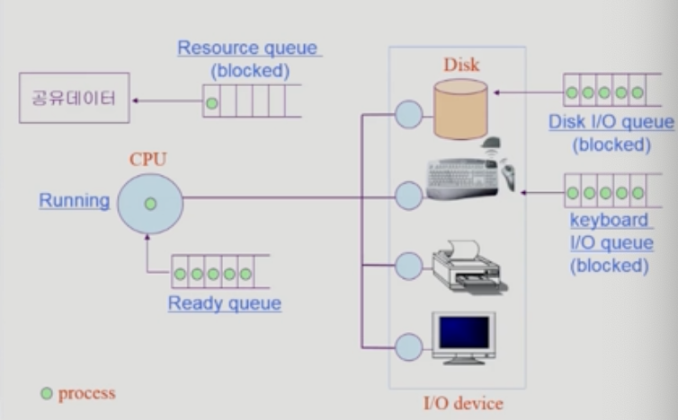
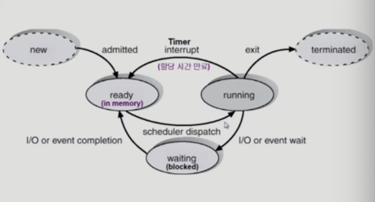
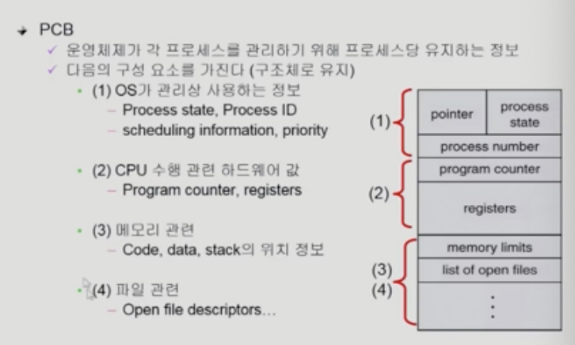
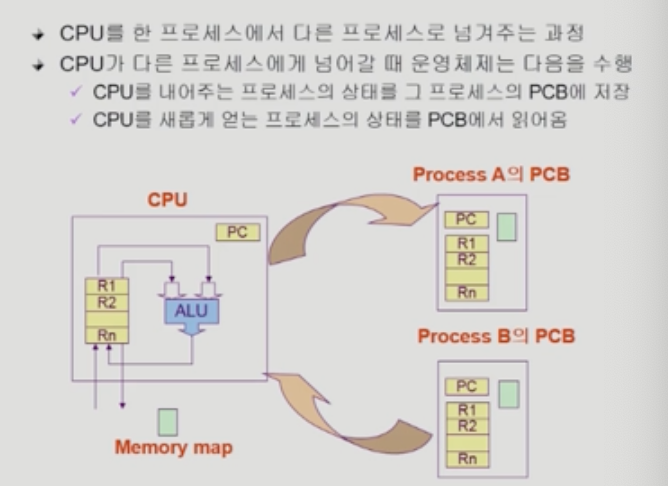
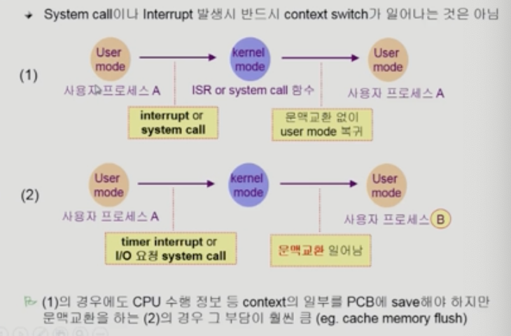
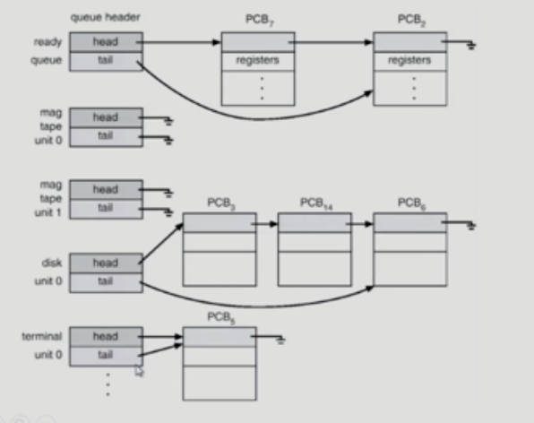
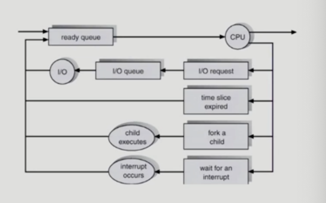
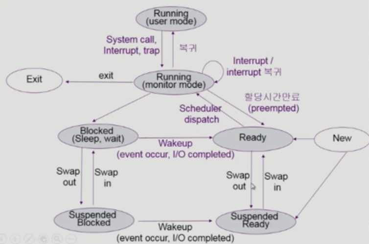
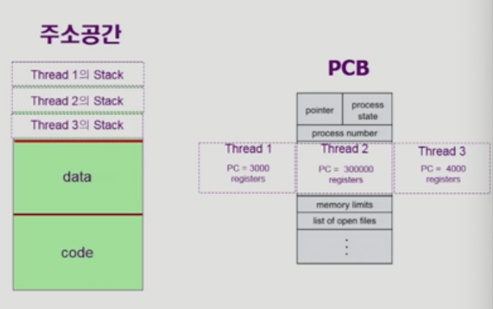

# 03-Process
## 프로세스의 개념
- Process is a program in execution (실행 중인 프로그램)
- 프로세스의 문맥 = 프로세스가 어떤 상태인가
### Process Context
- CPU 수행 상태를 나타내는 하드웨어 문맥
  - Program Counter
  - Register
- 프로세스 주소 공간
  - code, data, stack
- 프로세스 관련 커널 자료 구조
  - PCB (Process Control Block)
  - Kernel stack
## 프로세스의 상태

blocked 상태에 있는 프로세스는 요청한 작업이 수행되어야 CPU를 이용할 수 있음

공유 데이터: 프로세스간에 함께 사용하는 데이터

프로세스는 상태가 변경되며 수행된다
- Running
  - CPU를 가지고 instruction을 수행중인 상태
- Ready
  - CPU를 기다리는 상태 (다른 요청을 만족함)
- Block (wait, sleep)
  - CPU를 주어도 당장 instruction을 수행할 수 없는 상태
  - 프로세스가 요청한 이벤트가 즉시 만족되지 않아 이를 기다리는 상태
  - I/O 요청 필요한 경우 -> Blocked
## 프로세스 상태도

## PCB

- 관리상 사용하는 정보
  - 프로세스 상태, 프로세스 ID 저장함
  - 프로세스의 우선순위 관리
## 문맥 교환(Context Switch)

CPU를 비롯한 자원을 이미 프로세스가 사용중인 상태에서 다른 프로세스가 자원을 사용해야 할 경우에 프로세스의 상태 (문맥/ Context)를 보관하고 새로운 프로세스의 상태를 적재하는 것을 말함 (=CPU를 한 프로세스에서 다른 프로세스로 넘겨주는 과정)

CPU가 다른 프로세스에서 넘어갈 때 운영체제는 다음을 수행 
- CPU를 내어주는 프로세스의 상태를 그 프로세스의 PCB에 저장
- CPU를 새롭게 얻는 프로세스의 상태를 PCB에서 읽어 Register에 적재

사용자 프로세스 A -> 사용자 프로세스 B: 문맥 교환

사용자 프로세스 A -> interrupt: 문맥 교환 x

## 프로세스를 스케줄링하기 위한 큐
- Job queue: 현재 시스템 내에 있는 모든 프로세스의 집합
- Ready queue: 현재 메모리 내에 있으면서 CPU를 잡아서 실행되기를 기다리는 프로세스의 집합
- Device queue: I/O queue의 처리를 기다리는 프로세스의 집합

fork: 프로세스가 자식 프로세스를 만드는 경우
## 스케줄러 (Scheduler)
운영체제 함수, 코드의 일부분임

단기 스케줄러: CPU를 누구한테 얼마나 줄지. 자주 호출됨. timer interrupt시 마다 호출됨

장기 스케줄러
- 메모리를 주는 문제. new -> ready에서 admitted해주는 문제를 해결
- time sharing system(시분할)에서는 장기 스케줄러 필요 없음

중기 스케줄러
- time sharing system이 장기 스케줄러가 없는 대신에 중기 스케줄러가 존재함
- 프로세스에서 메모리를 뺏는 문제를 해결

### 프로세스의 상태
suspended (stopped)
- 외부적인 이유로 프로세스 수행이 정지됨
- 예: 중기 스케줄러에 의하여 메모리를 뺏긴 경우에 대한 상태

## 프로세스 상태도

swap out: 메모리를 빼앗긴 경우

프로세스가 시스템 콜, 인터럽트에 의하여 운영체제에게 CPU를 넘겼을 때에도 상태는 running으로 판단함
## Thread

프로세스에서 CPU 수행 단위

스택 부분만 별도로 가짐

코드의 어느 부분을 수행하고 있는가를 thread에 저장

동일한 프로세스에서 thread 1 -> thread 2를 넘어가는 것은 효율적임

스레드의 장점
- 응답이 빠르다
- 자원을 공유하는 효과가 있음
- 프로세스 1개 만드는 것보다 스레드 1개 만드는 것이 더 효율적(30배)
- 경량성
  
## Implementation of Threads

Kernel Threads: 커널에 의하여 실행됨

User Threads: 운영체제가 모르는 경우. 프로세스 내부에서 실행됨
