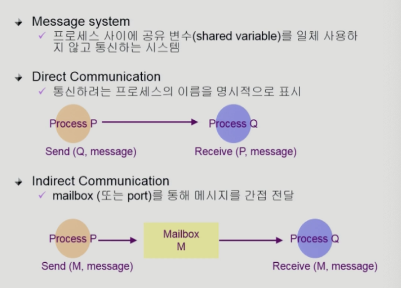

# 04-Process Management
## 프로세스 생성 (Process Creation)

- 부모 프로세스가 자식 프로세스를 생성
- 프로세스의 트리 구조 형성
- 부모-자식 간 자원을 공유하기도 하나 별개의 프로세스임
  
### 주소 공간 (Address space)

- 자식은 부모의 공간을 복사함 (binary and OS data)
- 자식은 그 공간에 새로운 프로그램을 올림

### 유닉스의 예
- `fork()` 시스템 콜이 새로운 프로세스를 생성
  - 부모를 그대로 복사 (OS data except PID + binary)
  - 주소 공간 할당
- fork 다음에 이어지는 `exec()` 시스템 콜을 통해 새로운 프로그램을 메모리에 올림

> fork: 부모가 실행하는 PC를 복사해서 자식 프로세스를 생성
> 
> exec: 완전히 새로운 프로그램을 덮어 씌움

## 프로세스 종료 (Process Termination)

- 프로세스가 마지막 명령을 수행한 후 운영체제에게 이를 알려줌 (**exit**)
  - 자식이 부모에게 output data를 보냄 (via **wait**).
  - 프로세스의 각종 자원들이 운영체제에게 반남됨
- 부모 프로세스가 자식의 수행을 종료시킴 (**abort**)
  - 자식이 할당 자원의 한계치를 넘어섬
  - 자식에게 할당된 태스크가 더 이상 필요하지 않음
  - 부모가 종료(exit)하는 경우
    - 운영체제는 부모 프로세스가 종료하는 경우 자식이 더이상 수행되도록 두지 않는다
    - 단계적인 종료

> exit: 명령 수행 후 종료
>
> abort: 부모 프로세스가 강제 종류

## `fork()` 시스템 콜

완전히 다른 프로그램을 돌리려면 fork 만으로는 불가능 -> exec 시스템 콜 필요

## `exec()` 시스템 콜

`execlp`를 하는 순간 새로운 프로그램이 바로 덮어씌워져서 실행됨

`execlp` 실행되면, 그 이후 코드는 실행되지 않음

## `wait()` 시스템 콜

자식 프로세스가 종료될 때까지 부모 프로세스가 blocked 상태

부모-자식 간에 자원을 가지고 경쟁하지 않아도 됨

## `exit()` 시스템 콜

- 프로세스의 종료
  - 자발적 종료
    - 마지막 statement 수행 후 exit() 시스템 콜을 통해
    - 프로그램에 명시적으로 적어주지 않아도 main 함수가 리턴되는 위치에 컴파일러가 넣어줌
  - 비자발적 종료
    - 부모 프로세스가 자식 프로세스를 강제 종료시킴
      - 자식 프로세스가 한계치를 넘어서는 자원 요청
      - 자식에게 할당된 태스크가 더 이상 필요하지 않음
    - 키보드로 kill, break 등을 친 경우
    - 부모가 종료하는 경우
      - 부모 프로세스가 종료하기 전에 자식들이 먼저 종료됨

## 프로세스 간 협력

원칙: 프로세스 간 협력하지 않음

경우에 따라 협력이 필요할 수 있음 -> IPC (Interprocess Communication)

## Message Passing

Shared Memory
- 공유할 메모리 공간이 정해지면 이를 사용함
- 프로세스가 신뢰할 수 있다는 전제 하