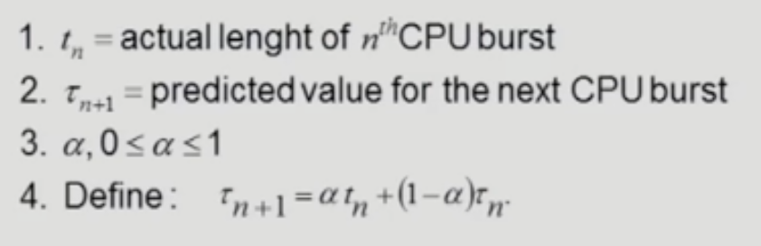

# CPU Scheduling
- [CPU Scheduling](#cpu-scheduling)
  - [CPU and I/O Bursts in Program Execution](#cpu-and-io-bursts-in-program-execution)
  - [CPU-burst Time의 분포](#cpu-burst-time의-분포)
  - [프로세스의 특성 분류](#프로세스의-특성-분류)
  - [CPU Scheduler \& Dispatcher](#cpu-scheduler--dispatcher)
  - [Scheduling Criteria](#scheduling-criteria)
  - [Scheduling Algorithms](#scheduling-algorithms)
    - [FCFS (First-Come First-Served)](#fcfs-first-come-first-served)
    - [SJF (Shortest-Job-First)](#sjf-shortest-job-first)
    - [SRTF (Shortest-Remaining-Time-First)](#srtf-shortest-remaining-time-first)
    - [Priority Scheduling](#priority-scheduling)
    - [RR (Round Robin)](#rr-round-robin)
    - [Multilevel Queue](#multilevel-queue)
    - [Multilevel Feedback Queue](#multilevel-feedback-queue)
  - [Multiple-Processor Scheduling](#multiple-processor-scheduling)
  - [Real-Time Scheduling](#real-time-scheduling)
  - [Thread Scheduling](#thread-scheduling)
  - [Algorithm Evaluation](#algorithm-evaluation)

## CPU and I/O Bursts in Program Execution
- 사람하고 인터렉션하는 프로그램일 경우 CPU와 I/O를 번갈아 씀
- CPU와 I/O의 빈도가 프로세스마다 상이함

> **burst time**
> 
> 한 작업을 연속적으로 처리하는 데 걸리는 시간

## CPU-burst Time의 분포
- CPU-burst Time: CPU를 한 번에 쓰는 시간
- CPU bound job: CPU를 길게 쓰는 프로그램
- I/O bound job: CPU를 짧게 쓰는 프로그램, 사람하고 인터렉션하는 프로그램이 많음
- CPU 스케줄링의 필요성
  - 시스템 안에 CPU bound job과 I/O bound job이 섞여있기때문
  - 여러 종류의 Job이 존재하므로

## 프로세스의 특성 분류
- 프로세스는 특성에 따라 2가지로 나뉨
- I/O-bound process
  - CPU를 잡고 계산하는 시간보다 I/O에 많은 시간이 필요한 job
  - many short CPU bursts
- CPU-bound process
  - 계산 위주의 job
  - few very long CPU bursts

## CPU Scheduler & Dispatcher
- 운영체제 안에 있는 소프트웨어. 특정 역할을 하는 코드의 일부
- **CPU Scheduler**
  - Ready 상태의 프로세스 중에서 CPU를 줄 프로세스를 고름
- **Dispatcher**
  - CPU의 제어권을 CPU scheduler에 의해 선택된 프로세스에세 넘김
  - 해당 과정을 문맥 교환(context switch)라고 함
- CPU 스케줄링이 필요한 경우는 프로세스에게 상태 변화가 있는 경우
    1. Running -> Blocked (예: I/O 요청하는 시스템 콜)
    2. Running -> Ready (예: 할당시간만료로 timer interrupt)
    3. Blocked -> Ready (예: I/O 완료 후 interrupt)
    4. Terminate
- nonpreemptive (=강제로 빼앗지 않고 자진 반납)
  - Running -> Blocked
  - Terminate
- All other scheduling is preemptive (=강제 반납)
- CPU Scheduling은 nonpreemptive, preemptive 둘 중 하나

## Scheduling Criteria
= Performance Index

= Performance Measure

= 성능 척도

- CPU utilization(이용률)
  - 전체 시간 중 CPU가 놀지 않고 일한 비율
  - keep the CPU as busy as possible
  - 높을수록 좋음
- Throughput(처리량)
  - 단위 시간 당 처리량
  - CPU 입장에서 얼마나 많은 일을 했느냐
  - Number of precesses that complete their execution per time unit
  - 처리량이 높을수록 좋음
- Turnaround time (소요시간, 반환시간)
  - CPU 사용한 시간 + CPU 기다린 시간
  - amount of time to execute a particular process
- Waiting time (대기 시간)
  - CPU를 쓰러와서 기다린 시간의 합
  - Ready queue에서 대기한 시간의 합
  - amount of time a process has been waiting in the ready queue
- Response time (응답 시간)
  - 어떤 프로세스가 CPU를 쓰러와서(=ready queue) 최초의 CPU를 얻기까지 걸린 시간
  - 처음 들어간 ready queue에서 CPU를 얻기 위해 걸린 시간
  - amount of time it takes from when a request was submitted until the first response is produced, not output (for time-sharing environment)

## Scheduling Algorithms

### FCFS (First-Come First-Served)
- nonpreemitive
- 먼저 온 프로세스부터 먼저 CPU 제공
- convoy effect
  - short process behind long process
  - CPU 이용시간이 긴 프로세스 뒤에 이용시간이 짧은 프로세스가 오는 경우

### SJF (Shortest-Job-First)
- CPU를 가장 짧게 쓰려는 프로세스에게 먼저 CPU 할당
- 각 프로세스의 다음번 CPU burst time을 가지고 스케줄링에 활용
- Two schemes
  - Nonpreemptive
    - 일단 CPU를 사용 중일 경우 해당 CPU burst가 완료될 때까지 반납하지 않음
  - Preemptive
    - 더 Optimal
    - shortest-remaining-time-first(SRTF)라고도 함
    - 현재 수행중인 프로세스보다 더 짧은 burst time을 가진 프로세스가 도착하면 CPU 강제반납
- SJF is optimal
  - 주어진 프로세스들에 대해 **Minimum average waiting time**을 보장
- starvation 발생
  - 짧은 프로세스에게 우선권을 주므로 long job은 영원히 CPU를 사용하지 못할 수 있음
- CPU burst time을 확신할 수 없음
  - 지난 번 burst time에 기반한 추정치임
- exponential average
  
  

### SRTF (Shortest-Remaining-Time-First)

### Priority Scheduling
- 우선순위가 높은 프로세스에게 CPU 할당
- 값이 작을수록 높은 priority
- A priority number (integer) is associated with each process
- preemptive, nonpreemptive 2가지 존재
- SJF는 일종의 priority scheduling임
- Problem
  - starvation: low priority processes may never execute
- Solution
  - Aging: as time progresses increase the priority of the process

### RR (Round Robin)
- 실제 CPU 스케줄링에서 가장 많이 사용하는 방법
- timer를 사용하여 일정 시간이 만료되면 interrupt를 사용하여 CPU 반납
- 각 프로세스는 동일한 크기의 할당 시간(time quantum)을 가짐. 일반적으로 10~100 ms
- 할당 시간이 지나면 프로세스는 preempted 당하고 ready queue의 제일 뒤에 가서 줄을 선다
- n개의 프로세스가 Ready queue에 있고 할당 시간이 q time unit인 경우 각 프로세스는 최대 q time unit 단위로 CPU 시간을 n등분하게 됨
  - 어떤 프로세스도 (n-1)*q time unit 이상 기다리지 않음
- Performance
  - q large -> FCFS
  - q small -> context switch 오버헤드 증가
- SJF보다 average turnaround time(소요시간)이 길지만 Response time(응답 시간)이 짧음

### Multilevel Queue
- Ready queue를 여러 개로 분할
- foreground: interative, RR
- background: batch - no human interaction, FCFS
- 각 큐는 독립적인 스케줄링 알고리즘을 가짐
- Fixed priority schduling
  - foreground가 완료된 뒤에 background 실행
- Time slice
  - 각 큐에 cpu time을 적절한 비율로 할당

### Multilevel Feedback Queue
- 프로세스가 다른 큐로 이동 가능
- 각각의 큐에 대한 우선순위를 정하는 기준(파라미터)는 다양함
- aging: 주기적으로 우선순위가 최상단인 큐로 이동

## Multiple-Processor Scheduling
- CPU가 여러 개인 경우
- Homogeneous processor인 경우
  - queue에 한 줄로 세워서 각 프로세서가 알아서 꺼낼 수 있도록 함
  - 반드시 특정 프로세서에서 수행되어야 하는 프로세스가 있는 경우에는 문제가 복잡해짐
- Loading sharing
  - 일부 프로세서에 job이 몰리지 않도록 부하를 적절히 공유하는 메커니즘 필요
  - 별개의 큐 vs 공동 큐
- Symmetric Multiprocessing (SMP)
  - 각 프로세서가 각자 알아서 스케줄링 결정
  - 여러 CPU가 대등하게 일을 함. 각 CPU들이 알아서 스케줄링을 할 수 있도록 함
- Asymmetric multiprocessing
  - 하나의 프로세서가 시스템 데이터의 접근과 공유을 책임지고 나머지 프로세서는 거기에 따름

## Real-Time Scheduling
- Hard real-time systems
  - deadline을 어길 수 없음
  - Hard real-time task는 정해진 시간 안에 반드시 끝내도록 스케줄링해야 함
- Soft real-time computing
  - 일반 프로세스에 비해 높은 Priority를 갖도록 해야 함
  - 동영상 스트리밍

## Thread Scheduling
- Local Scheduling
  - User level thread의 경우, 프로세서 내부에서 어느 스레드에게 cpu를 줄 지 결정하는 방식
  - 운영체제가 스레드의 존재를 모름
  - 사용자 수준의 thread library에 의해 어떤 thread를 스케줄할지 결정
- Global Scheduling
  - Kernel level thread의 경우
  - 운영체제가 스레드의 존재를 앎
  - 운영체제가 직접 cpu scheduling
  - 커널의 단기 스케줄러가 어떤 thread를 스케줄할지 결정

## Algorithm Evaluation
- Queueing models
  - 이론적인 계산
  - 확률 분포로 주어지는 arrival rate와 service rate 등을 통해 각종 performance index 값을 계산
  - arrival rate: 얼마나 빠른 빈도로 도착하는지
  - service rate: 단위 시간당 얼마나 일을 하는지
- Implementation & Measurement
  - 실제 시스템에 알고리즘을 구현하여 실제 작업에 대해서 성능을 측정 및 비교
- Simulation
  - 알고리즘을 모의 프로그램으로 작성 후, trace를 입력으로 하여 결과 비교
  - trace: 시뮬레이션의 input이 되는 Data, 신빙성이 있어야 함
  - 시뮬레이션을 할 경우, 실제 프로그램에서 trace를 추출하여 쓰는 경우도 있음