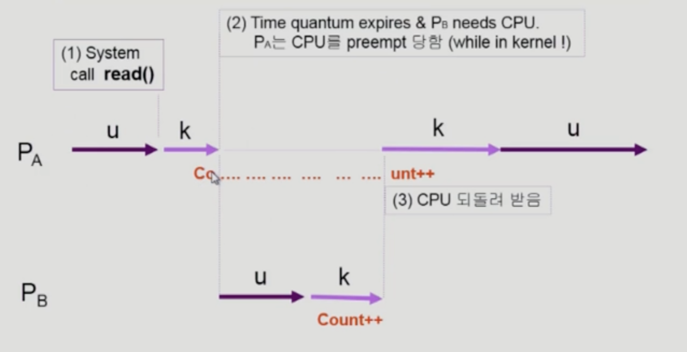
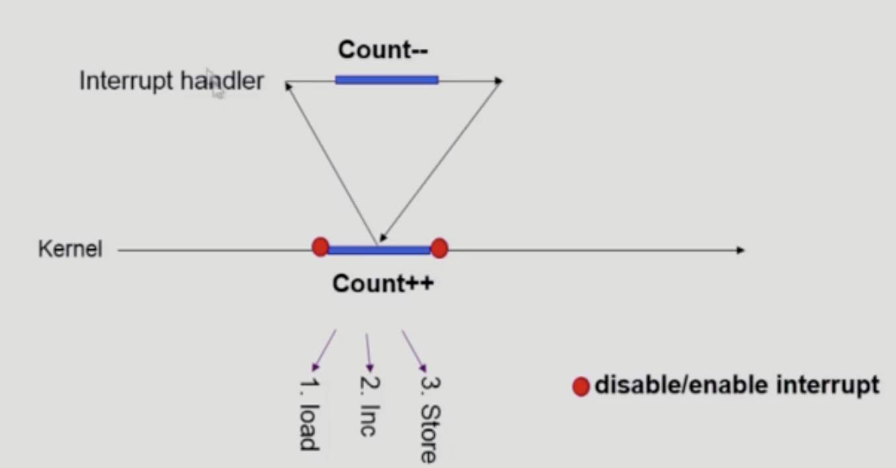
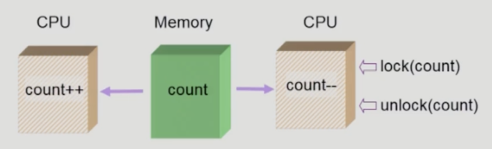
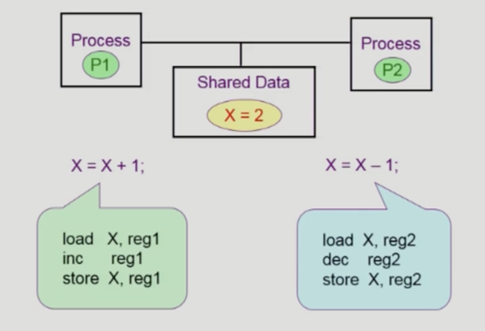
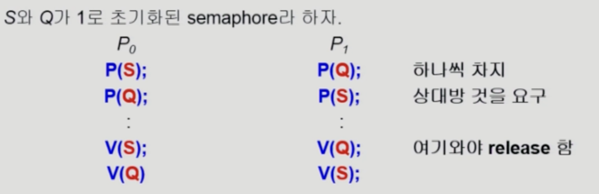
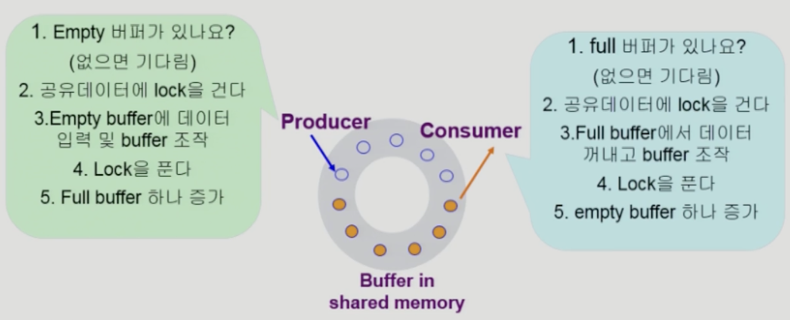
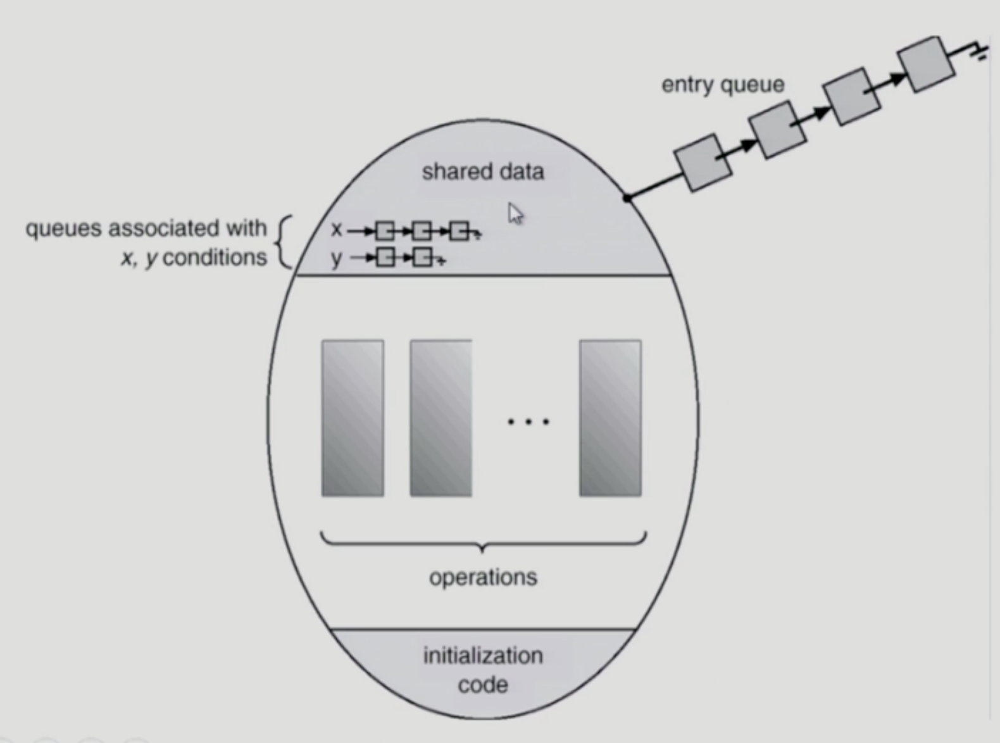

# Process Synchronization

## 데이터의 접근
- 컴퓨터 안에서 연산이 이루어지면서 데이터를 어떻게 접근하는가?
  - 데이터를 읽은 후, 연산, 연산 결과 저장
  - 여러 군데에서 읽어와서 연산을 하므로 문제가 생길 수 있음

## Race Condition
  - S-box를 공유하는 E-box가 여럿 있는 경우 Race Condition의 가능성 존재
    - S-box: Storage box
    - E-box: Execution box
    - 서로 다른 프로세스들끼리는 주소 공간을 침범하지 않으므로 상관없음. but, 공유메모리를 사용하는 프로세스 간에 문제 발생 가능
    - 운영체제 안에 존재하는 데이터를 사용하는 경우 해당 문제 발생 가능

### OS에서 race condition은 언제 발생하는가?
  
- 프로세스가 시스템 콜을 하여 커널 모드로 수행 중인데 context switch가 일어나는 경우
  - 
  - 해결책: 커널 모드에서 수행 중 일때는 CPU를 preempt하지 않음

- 커널 모드 수행 중 인터럽트가 발행할 경우
  - 
  - 커널 모드 수행 중일 경우 인터럽트를 불가능하게 함 (disable)

- multiprocessor에서 공유 메모리 내의 커널 데이터를 사용할 경우
  - 
  - CPU가 여러 개 있는 상황에서 다른 프로세서가 운영체제의 코드를 사용함
  - interrupt를 막아서 해결할 수 있는 문제가 아님
  - 해결책
    - 한번에 하나의 CPU만이 커널에 들어갈 수 있게 함
    - 커널 내부에 있는 각 공유 데이터에 접근할 때마다 그 데이터에 대한 Lock/unlock를 함

## Process Synchronization 문제
- 공유 데이터의 동시 접근은 데이터의 불일치 문제를 발생
- 협력 프로세스 간의 실행 순서를 정해주는 메커니즘 필요
- 

### The Critical-Section Problem
- n개의 프로세스가 공유 데이터를 동시에 사용하기를 원하는 경우
- Critical section: 각 프로세스의 code segment에는 공유 데이터를 접근하는 코드
- 하나의 프로세스가 Critical section에 있을 때 다른 모든 프로세스는 critical section에 들어갈 수 없어야 함

## 프로그램적 해결법의 충족 조건
- Mutual Exclusion (상호 배제)
  - 프로세스 Pi가 critical section을 수행 중이면 다른 모든 프로세스들은 들어갈 수 없음
- Progress (진행)
  - 아무도 critical section에 있지 않은 상태에서 critical section에 들어가고자 하는 프로세스가 있으면 들어가도록 해야 함
- Bounded Waiting (유한대기)
  - starvation을 막아야 함
  - 프로세스가 기다리는 시간이 유한해야 함
  - 프로세스가 critical section에 들어가려고 요청한 후부터 그 요청이 허용될 때까지 다른 프로세스들이 Critical section에 들어가는 횟수에 한계가 있어야 함

### Algorithm 1
- 동시 접근을 막기 위해서 Turn이라는 synchronization variable을 사용
- turn을 체크해서 상대방 차례일 경우 계속 기다림(while문에 갇혀있음)
- critical section을 다 쓰고 나갈 때, turn을 변경함
```c
do {
  while (trun != 0);
  critical section
  turn = 1;
  remainder section
} while (1);
```
- 과잉양보
  - 반드시 한번씩 교대로 들어가야만 함 (swap-turn)
  - 단점: 극단적으로 critical section을 사용하는 빈도 수가 차이날 경우
  - Satisfies mutual exclusion, but not process requirement

### Algorithm 2
- synchronization variables: flag 사용
```c
do {
  flag[i] = true;
  while (flag[j]); // 다른 프로세스의 critical section 참여 여부 확인
  critical section
  flag[i] = false;
  remainder section
} while (1);
```
- flag가 true이지만, critical section을 수행하지 못한 경우 계속 flag가 true이기 때문에, 무한 대기하는 상황이 발생할 수 있음
- Satisfies mutual exclusion, but not process requirement

### Algorithm 3 (Peterson's Algorithm)
- Combined Synchronization variables of algorithms 1 and 2.
```c
do {
  flag[i] = true;
  turn = j;
  while (flag[j] && turn == j); // 상대방이 깃발을 들고 있고, turn이 상대방 차례인지
  critical section
  flag[i] = false;
  remainder section
} while (1);
```
- Meets all three requirements
- 단점
  - busy waiting (= Spin lock)
  - 계속 CPU와 Memory를 쓰면서 대기해야 함
  - 비효율적임

## Synchronization Hardware
- synchronization을 하드웨어적으로 보조
- 하드웨어적으로 Test & modify를 atomic하게 수행할 수 있도록 지원하면 소프트웨어가 필요하지 않음
- Test_and_set
  - 하드웨어적인 지원이 되는 연산
  - 현재 a의 값을 읽어내고, 읽힌 값과 상관없이 a를 True로 설정한다
  - Synchronization variable: lock (boolean)
```c
do {
  while(Test_and_Set(lock)); // 누군가가 쓰고 있는지 확인
  critical section
  lock = false;
  remainder section
}
```

## Semaphores
- 일종의 추상 자료형
- Semaphore S
  - integer variable
  - 아래 2가지 atomic 연산에 의해서만 접근 가능
  - P(S): 자원을 획득하는 과정
  - V(S): 자원을 반납하는 과정

```c
semaphore mutex; // initial 1
do {
  P(mutex);
  critical section
  V(mutex);
  remainder section
} while (1);
```
- 효율적으로 synchronization을 해결할 수 있음
- busy-wait는 효율적이지 못함

### Block / Wakeup Implementation
- semaphore를 새로 정의
```c
typedef struct
{
  int value;
  struct process *L;
} semaphore;
```
- block
  - 커널은 block을 호출한 프로세스를 suspend
  - 이 프로세스의 PCB를 semaphore에 대한 wait queue에 넣음
- wakeup(P)
  - block된 프로세스 P를 wakeup 시킴
  - 이 프로세스의 PCB를 ready queue로 옮김

- P(S)
  ```c
  S.value--;
  if (S.value < 0)
  {
    add this process to S.L;
    block();
  }
  ```
- V(S);
  ```c
  S.value++;
  if (S.value <= 0) 
  {
    remove a process P from S.L;
    wakeup(P);
  }
  ```

### Which is better?
- busy-wait vs block/wakeup
  - 일반적으로 block/wakeup이 좋음
  - Critical section의 빈도 수가 많은 경우 -> block/wakeup
  - Critical section의 빈도 수가 적은 경우 -> busy-wait

### Two Types of Semaphores
- Counting semaphore
  - 도메인이 0 이상인 임의의 정수값
  - 주로 Resource counting에 사용
- Binary semaphore (=mutex)
  - 0 또는 1 값만 가질 수 있는 Semaphore
  - 주로 mutual exclusion (lock/unlock)에 사용

## Deadlock and Starvation
### Deadlock
- 둘 이상의 프로세스가 서로 상대방에 의해 충족될 수 있는 이벤트를 무한히 기다리는 현상
- 

### Starvation
- indefinite blocking
- 프로세스가 suspend된 이유에 해당하는 세마포어 큐에서 빠져나갈 수 없는 현상

## Classical Problems of Synchronization
- 동기화에서 발생하는 문제들

### Bounded-Buffer Problem (Producer-Consumer Problem)
- 프로세스의 종류
  - producer: 데이터를 만들어서 Buffer에 집어넣음
  - consumer: 데이터를 buffer에서 꺼냄
- 두 producer가 동시에 한 버퍼에 데이터를 집어 넣는 문제가 발생할 수 있음
- 데이터가 한 개이지만 두 consumer가 동시에 한 데이터를 꺼내가는 문제가 발생할 수 있음
- 
- synchronization variables
  - full = 0
  - empty = n
  - mutex = 1
- Producer
```c
do {
  P(empty); // 빈 버퍼를 얻는다
  P(mutex);
  add x to buffer
  V(mutex);
  V(full);
} while (1);
```
- Consumer
```c
do {
  P(full);
  P(mutex);
  remove an item from buffer to y
  V(mutex);
  V(empty);
  consume the item in y
} while (1);
```
### Readers and Writers Problem
- 한 프로세스가 db에 write 중일 때 다른 프로세스가 접근하면 안됨
- read는 동시에 여러 프로세스가 진행하여도 상관 없음
- solution
  - writer가 DB에 접근 허가를 얻지 못한 상태에서는 모든 대기 중인 Reader 접근 가능
  - writer가 DB에 접근 중이면 모든 Reader의 접근 금지
- Shared data
  - readcount: 현재 DB에 접근 중인 Reader의 수
- Synchronization variables
  - mutex: 공유 데이터인 readcount에 접근하는 코드의 mutual exclusion 보장을 위해 사용
  - db: DB의 lock를 위한 변수

```c
int readcount = 0;
DB;
semaphore mutex = 1, db = 1;

// writer
P(db);
writing DB is performed
V(db);

// reader
P(mutex);
readcount++;
if (readcount == 1) P(db); // block writer
V(mutex);

reading DB is performed

P(mutex);
readcount--;
if (readcount == 0) V(db); // enable writer
V(mutex);
```
- 단점: writer의 starvation이 발생할 수 있음
- 일정 시간 이후에 도착한 reader에 대해서 접근을 차단하면 Starvation 문제를 해결할 수 있음

### Dining-Philosophers Problem
- 데드락 발생 가능 (모든 철학자가 동시에 왼쪽 젓가락을 집은 경우)
- Solved
  - 4명의 철학자만이 테이블에 동시에 앉을 수 있도록 함 (circular wait)
  - 젓가락 2개를 모두 잡을 수 있을 때에만 젓가락을 집을 수 있도록 함 (hold and wait)
  - 짝수 철학자는 왼쪽 젓가락부터 집도록

## Monitor
- Semaphore의 문제점
  - 코딩이 어려움
  - 정확성의 입증 어려움
  - 자발적 협력이 필요함
  - 한번의 실수가 모든 시스템에 치명적 영향
  - Mutual exclusion 깨짐 or Deadlock 발생 가능
- Monitor
  - 동시 수행 중인 프로세스 사이에서 abstract data type의 안전한 공유를 보장하기 위한 High-level synchronization construct
  - 공유 데이터에 대하여 Lock를 걸 필요가 없어짐
  - 
  - 모니터 내에서는 한번에 하나의 프로세스만이 활동 가능
  - condition variable: x, y
    - 프로세스가 모니터 안에서 기다릴 수 있도록 하기 위해 사용하는 함수
    - 큐의 역할을 함 
    - wait: 자원의 여분이 없을 경우 프로세스를 대기
    - signal: suspend된 프로세스를 resume

### Bounded-Buffer Problem
- 생산자-소비자 문제

```c
monitor bounded_buffer
{
  int buffer[N];
  condition full, empty;

  void produce(int x){
    if there is no empty buffer
      empty.wait();
    add x to an empty buffer
    full.signal();
  }

  void consume(int *x){
    if there is no full buffer
      full.wait();
    remove an item from buffer and store it to *x
    empty.signal(); // empty에 대기중인 produce를 깨움
  }
}
```
### Dining Philosophers Example
```c
monitor dining_philosopher {
  enum {thinking, hungry, eating} state[5];
  condition self[5]; // 젓가락을 못잡을때 대기 큐
  
  void pickup(int i) {
    state[i] = hungry;
    test(i);
    if (state[i] != eating)
      self[i].wait();
  }

  void putdown(int i) {
    state[i] = thinking;
    test((i+4) % 5);
    test((i+1) % 5);
  }

  void test(int i) {
    if ((state[(i+4)%5] != eating) && (state[(i+1)%5] != eating) && (state[i] == hungry)) {
      state[i] = eating;
      self[i].signal(); // 밥먹기
    }
  }

  void init() {
    for (int i=0; i<5; i++) {
      state[i] = thinking;
    }
  }
}

Each Philosopher:
{
  pickup(i);
  eat();
  putdown(i);
  think();
} while(1)
``` 