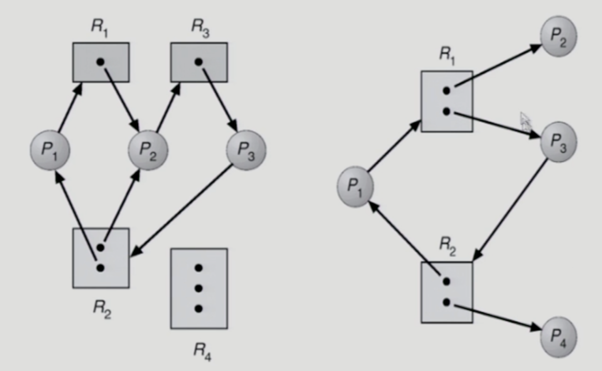
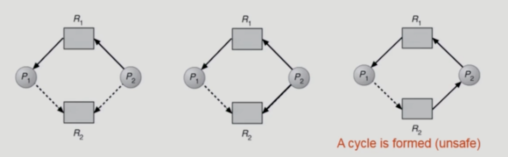

# Deadlocks
- 교착상태: 더 이상 진행할 수 없는 상태
- 일련의 프로세스들이 서로가 가진 자원을 기다리며 block된 상태
- Resource (자원)
  - 하드웨어, 소프트웨어를 포함하는 개념
  - ex) I/O device, CPU cycle, memory space, semaphore
  - 프로세스가 자원을 사용하는 절차
    - Request, Allocate, Use, Release

## Deadlock 발생의 4가지 조건
- Mutual exclusion (상호 배제)
  - 매 순간 하나의 프로세스만이 자원을 사용할 수 있음
- No preemption (비선점)
  - 프로세스는 자원을 스스로 내어놓을 뿐 강제로 빼앗기지 않음
- Hold and wait
  - 자원을 가진 프로세스가 다른 자원을 기다릴 때 보유 자원을 놓지 않고 계속 가지고 있음
- Circular wait
  - 자원을 기다리는 프로세스 간에 사이클이 형성되어야 함

## Resource-Allocation Graph(자원 할당 그래프)
- Vertex
  - Process P
  - Resource R
- Edge
  - request edge Pi -> Rj
  - assignment edge Rj -> Pi
- 그래프에 cycle이 없으면 deadlock이 아님
- 그래프에 cycle이 있으면
  - if only one instance per resource type, then deadlock
  - if several instances per resource type, possibility of deadlock
- 

## Deadlock의 처리 방법
- Deadlock prevention
  - 데드락을 미연에 방지하는 방법 중 가장 강력
  - 자원 할당 시 Deadlock의 4가지 필요 조건 중 어느 하나가 만족되지 않도록 하는 것
  - mutual exclusion
    - 공유해서는 안되는 자원의 경우 반드시 성립해야 함
  - hold and wait
    - 프로세스가 자원을 요청할 때 다른 어떤 자원도 가지고 있지 않게 함
    - 1. 프로세스 시작 시 모든 필요한 자원을 할당 -> 낭비
    - 2. 자원이 필요한 경우 보유 자원을 모두 놓고 다시 요청
  - no preemption
    - 자원을 빼앗을 수 있도록 함
    - 프로세스가 어떤 자원을 기다려야 하는 경우 이미 보유한 자원이 선점됨
    - 모든 필요한 자원을 얻을 수 있을 때 그 프로세스는 다시 시작함
    - state를 쉽게 save하고 Restore 할 수 있는 자원에서 주로 사용 (CPU, memory)
    - no preemption이 안되는 자원도 존재
  - circular wait
    - 모든 자원 유형에 할당 순서를 정하여 정해진 순서대로만 자원 할당
    - 자원에 번호를 매겨서 1번 자원을 얻어야 2번 자원을 얻을 수 있도록 함
  - Utilization 저하, throughput 감소, starvation 발생
    - 비효율적임
- Deadlock Avoidance
  - 데드락을 미연에 방지
  - 자원 요청에 대한 부가적인 정보를 이용해서 자원 할당이 deadlock으로부터 안전한 지를 동적으로 조사하여 안전한 경우에만 할당
  - 프로세스들이 필요로 하는 각 자원별 최대 사용량을 미리 선언하도록 함
  - safe state
    - 시스템 내의 프로세스들에 대한 safe sequence가 존재하는 상태
  - safe sequence
    - 일종의 자원을 필요로 하는 프로세스에게 자원을 할당해주는 순서
  - Banker's Algorithm
    - 추가로 요청 가능한 최대 자원을 미리 계산함(Need)
    - 자원에 여유가 있더라도 최대 요청할 자원이 여유 자원을 넘어갈 경우 자원을 할당하지 않음
- Deadlock Detection and recovery
  - 데드락 발생은 허용하되 그에 대한 detection 루틴을 두어 데드락 발견 시 Recover
  - Deadlock Detection
    - resource type 당 single instance인 경우
      - 자원 할당 그래프에서의 사이클이 곧 데드락을 의미
    - resource type 당 multiple instance인 경우
      - Banker's algorithm과 유사한 방법 활용
    - ㅈ
- Deadlock Ignorance
  - deadlock을 시스템이 책임지지 않음
  - UNIX를 포함한 대부분의 OS가 채택
  - 시스템에 데드락이 발생한 경우 유저가 직접 프로세스를 죽임

### Resource Allocation Graph algorithm
- claim edge Pi -> Rj
  - 프로세스 Pi가 자원 Rj를 미래에 요청할 수도 있음을 뜻함 (점선)
  - 프로세스가 해당 자원 요청 시 request edge(실선)로 바뀜
  - Rj가 release 되면 assignment edge는 다시 claim edge로 변경됨
- Deadlock Avoidance: 당장 데드락은 아니지만, 데드락의 위험성이 있을 경우 자원 할당을 하지 않음
- 

