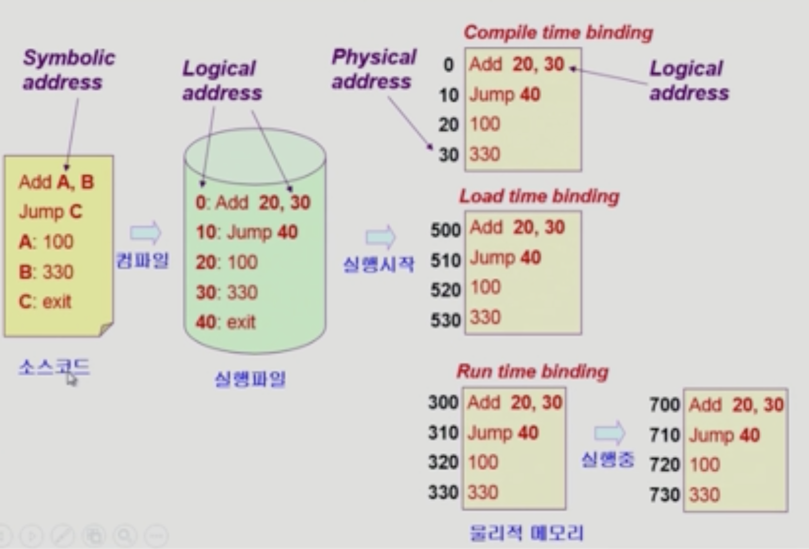

# Memory Management

## Logical vs. Physical Address

### Logical address (=vitual address)
- 프로세스마다 가상 메모리의 주소가 존재함
- 프로세스마다 독립적으로 가지는 주소 공간
- 각 프로세스마다 0번지부터 시작
- CPU가 보는 주소는 logical address임

### Physical address
- 메모리에 실제 올라가는 위치

## 주소 바인딩 (Address Binding)
- 주소 바인딩
  - 주소를 결정하는 것
  - Symbolic Address -> Logical Address -> Physical address
    - Symbolic Address: 프로그래머가 메모리 주소를 변수로 활용하는 것
  - 논리적인 주소를 물리적인 주소로 변환하는 것이 필요함
  - 운영체제가 아닌 하드웨어가 진행함

### Complie time binding
- 물리적 메모리 주소(physical address)가 컴파일 시 알려짐
- 시작 위치 변경 시 재컴파일
- 컴파일러는 절대 코드(absolute code) 생성

### Load time binding
- 프로그램을 실행시키는 시점에 가상 메모리 주소가 물리적인 메모리 주소로 바뀜
- 실행시작되는 시점에 물리적인 주소가 매겨지고, 바뀌지 않음
- Loader의 책임하에 물리적 메모리 주소 부여
- 컴파일러가 재배치가능코드(relocatable code)를 생성한 경우 가능
  - 물리적인 메모리가 바뀔 수 있는 코드

### Run time binding (=Execution time binding)
- 프로그램이 시작될 때 물리적인 메모리 주소가 매겨짐
- 프로그램 수행 중에도 메모리 상 위치를 옮길 수 있음
- CPU가 주소를 참조할 때마다 Binding를 점검 (address mapping table)
- 하드웨어적인 지원이 필요(base and limit registers, MMU)

## Memory-Management Unit (MMU)
- 주소변환을 하는 하드웨어
- logical address를 Physical address로 매핑해주는 hardware device
- 사용자 프로세스가 cpu에서 수행되며 생성해내는 모든 주소값에 대해 base register의 값을 더함
- user program
  - logical address만을 다룸
### Dynamic Relocation
- 

### Hardware Support for Address Translation
- 
- Trap: 일종의 소프트웨어 인터럽트
- Relocation register (=base register)
  - 물리적인 메모리의 시작 위치
  - 접근할 수 있는 물리적 메모리 주소의 최솟값
- Limit register
  - 논리적 주소의 범위
  - 프로세스의 크기를 담고 있음

## Some Termonologies
### Dynamic Loading
- 프로세스 전체를 메모리에 미리 다 올리는 것이 아니라 해당 루틴이 불려질 때 메모리에 Load하는 것
- memory utilization의 향상
- 가끔씩 사용되는 많은 양의 코드의 경우 유용함
  - 예: 오류 처리 루틴
- 운영체제의 특별한 지원 없이 **프로그램 자체에서 구현** 가능
- Loading: 메모리로 올리는 것
- 현대적인 os에서 사용하는 방식은 아님

### Dynamic Linking
- Linking을 실행 시간(execution time)까지 미루는 기법
- Static linking (<- static library)
  - 라이브러리가 프로그램의 실행 파일 코드에 포함됨
  - 단점
    - 실행 파일의 크기가 커짐
    - 동일한 라이브러리를 각각의 프로세스가 메모리에 올리므로 메모리 낭비
- Dynamic linking (<- shared library, shared object)
  - 라이브러리가 실행시 Linking됨
  - 라이브러리의 위치 정보만을 포함
  - 라이브러리 호출 부분에 라이브러리 루틴의 위치를 찾기 위한 stub이란 작은 코드를 둠
  - 라이브러리가 이미 메모리에 있으면 그 루틴의 주소로 가고 없으면 디스크에서 읽어옴
  - 운영체제의 도움이 필요함
  - linux: .so
  - windows: .dll

### Overlays
- 메모리에 프로세스의 부분 중 실제 필요한 정보만을 올림
- dynamic loading과 의미는 같으나 다르게 쓰임
- 프로세스의 크기가 메모리보다 클 때 유용
- 운영체제의 지원없이 사용자에 의해 구현
- 프로그래머가 온전히 수작업으로 구현함
  - Manual Overlay
  - 프로그래밍이 매우 복잡함

### Swapping
- 프로세스를 일시적으로 메모리에서 backing store로 쫓아내는 것
- 
- backing store (=swap area)
- swap in / swap out
  - 일반적으로 중기 스케줄러에 의해 swap out 시킬 프로세스를 선정함
  - priority-based CPU scheduling algorithm
    - priority가 높은 프로세스를 메모리에 올려놓음
    - 낮은 프로세스는 swapped out.
  - complie time, load time binding에서는 원래 메모리 위치로 swap in 해야 함
  - Run time binding에서는 빈 메모리 어디서든지 효율적으로 사용 가능
  - swap time은 대부분 transfer time이 상당 시간을 차지함

## Allocation of Physical Memory
- 메모리는 일반적으로 두 영역으로 나눔
  - os 상주 영역
  - 사용자 프로세스 영역
- 사용자 프로세스 영역의 할당 방법
  - Contiguous allocation (연속 할당)
    - 각각의 프로세스가 메모리의 연속적인 공간에 적재되도록 하는 것
    - Fixed partition allocation
    - Variable partition allocation
  - Noncontiguous allocation (불연속 할당)
    - 하나의 프로세스가 메모리의 여러 영역에 분산되어 올라갈 수 있음
    - Paging
    - Segmentation
    - Paged Segmentation
  
### Contiguous allocation
- 고정 분할 방식(Fixed partition allocation)
  - 물리적 메모리를 여러 개의 파티션으로 분할함
  - 내부 조각: 파티션 내에 프로세스가 사용하지 않는 남는 공간
  - 외부 조각: 프로세스 크기보다 작아 사용되지 않는 공간
  - 단점: 외부, 내부 조각과 같이 남는 공간이 생김
- 가변 분할 방식(Variable partition allocation)
  - 분할하지 않고 가변적으로 사용함
  - 프로세스가 종료 후 다른 프로세스가 해당 메모리를 사용하지 않으면 동일하게 외부 조각이 생길 수 있음

- External fragmentation (내부 조각)
  - 프로그램 크기보다 분할의 크기가 작은 경우
  - 아무 프로그램에도 배정되지 않은 빈 곳인데로 프로그램이 올라갈 수 없는 작은 분할을 의미
- Internal fragmentation (외부 조각)
  - 프로그램 크기보다 분할의 크기가 큰 경우
  - 하나의 분할 내부에서 발생하는 사용되지 않는 메모리 조각
  - 특정 프로그램에 배정되었지만 사용되지 않는 공간
- Hole
  - 가용 메모리 공간
  - 다양한 크기의 Hole들이 메모리 여러 곳에 흩어져 있음
  - 프로세스가 도착하면 수용가능한 Hole를 할당
  - 운영체제는 다음의 정보를 유지
    - 할당 공간
    - 가용 공간(hole)

- Dynamic Storage-Allocation Problem
  - 가변 분할 방식에서 size n인 요청을 만족하는 가장 적절한 Hole를 찾는 문제
  - first-fit
    - size가 n 이상인 hole 중 최초로 찾아지는 hole에 할당
  - best-fit
    - size가 n 이상인 가장 작은 Hole을 찾아서 할당
    - 단점
      - 탐색 오버헤드 존재
      - 많은 수의 아주 작은 Hole들이 생성
  - worst-fit
    - 가장 큰 hole에 할당
    - 모든 리스트 탐색해야 함
  - compaction
    - 사용 중인 메모리 영역을 한군데로 몰고 Hole들을 다른 한 곳으로 몰아 큰 block를 만드는 것
    - 매우 비용이 많이 드는 방법
    - 최소한의 메모리 이동으로 Compaction해야 함
    - 프로세스 주소가 실행 시간에 동적으로 재배치 가능한 경우에만 사용 가능 (run-time binding)

### Noncontiguous allocation
#### Paging
- 프로세스를 구성하는 주소 공간이 동일 페이지로 쪼개져 있음
- 프로세스의 가상 메모리를 동일한 사이즈의 페이지 단위로 나눔
- 일부는 backing storage, 일부는 physical memory에 저장
- Basic Memory
  - physical memory를 동일 크기의 Frame로 나눔
  - logical memory를 동일 크기의 Page로 나눔 (frame과 같은 크기)
  - page table을 사용하여 주소 변환함
    - 각각의 Page가 physical memory의 어디 frame에 위치했는지 기록
    - 각 정보를 entry라고 부름
- Memory Protection
  - Page table의 각 Entry마다 bit를 둠
  - Protiection bit
    - page에 대한 접근 권한(read/write/read-only) 등
    - 동일 page에 code와 data가 함께 존재할 경우, 여러 권한이 혼재해야하는 단점 존재 -> segmentation과 반대
  - Valid-invalid bit
    - valid: 해당 주소의 frame에 그 프로세스를 구성하는 유효한 내용이 있음을 뜻함 (접근 허용)
    - invalid: 해당 주소의 Frame에 유효한 내용이 없음을 뜻함 (접근 불허)
- Implememtation of Page Table
  - Page table은 메인 메모리에 상주
  - Page-table base register(PTBR)가 page table을 가리킴
  - Page-table length register(PTLR)가 테이블 크기를 보관
  - 모든 메모리 접근 연산에는 2번의 메모리 접근이 필요
  - page table 접근 1번, 실제 data/instruction 접근 1번
  - 속도 향상을 위해
    - associative register or translation look-aside buffer(TLB)라 불리는 고속의 lookup hardware cache 사용
  - CPU가 logical address를 주면 TLB 테이블을 확인하여 접근, 없을 경우 Page table를 사용하여 주소 변환
    - TLB
      - index를 통해서 접근하는 것이 아님
      - page number와 frame number 모두 필요함
      - 순차적으로 탐색하는 것은 오버헤드를 유발하므로 associative register를 사용하여 병렬적으로 탐색함
    - Page table: index(page number)를 통해서 접근하므로 frame number만 가지고 있으면 됨
      - 프로세스마다 page table 존재
- Effective Access Time
  - 
- Two-Level Page Table
  - outer-page table, page table 2 단계로 구성함
  - 주소 변환을 위해서 메모리를 2번 접근해야 함
  - 시간 상으로 손해임
  - 공간 상으로 이득
  - 계층적으로 페이지 테이블을 분리한 것
  - 
- Multilevel Paging and Performance
  - Address space가 더 커지면 다단계 페이지 테이블 필요
  - 각 단계의 페이지 테이블이 메모리에 존재하므로 logical address의 physical address 변환에 더 많은 메모리 접근 필요
  - TLB를 통해 메모리 접근 시간을 줄일 수 있음
- valid/invalid bit in a page table
  - 해당 페이지가 메모리에 올라가있는지 여부를 표시
- Inverted Page Table
  - page table이 매우 큰 경우
  - 
  - 메모리 공간 낭비를 막기 위해 사용
  - 물리적인 주소를 가지고 논리적인 주소를 얻어냄
  - 주소 변환 자체에는 별반 도움이 되지 않음
  - process-id: 어떤 프로세스의 page인지를 저장
  - Page frame 하나당 Page table에 하나의 entry를 둔 것
  - 단점: 테이블 전체를 탐색해야 함
    - associative register 사용
- Shared Page
  - 동일한 프로세스를 여러번 수행할 경우 공통된 코드 부분이 존재함
  - 물리적인 메모리에 동일한 코드를 여러 번 올리면 비효율적임
  - Shared code
    - Re-entrant Code (=Pure Code)
    - read-only로 하여 프로세스 간에 하나의 code만 메모리에 올림
    - 2가지 제약 조건
      - 1. Read-only
      - 2. 동일한 Logical address space
  - Private code and data
    - 프로세스마다 독자적으로 가지는 코드 및 데이터
#### Segmentation
- 의미 단위(segment)로 잘라서 주소 공간을 자르고 분배함
- 일반적으로 code, data, stack으로 구분
- <segment-number, offset>으로 구성
- Segment table
  - segment의 길이가 모두 다르므로 물리적인 주소의 길이에 대한 정보가 필요함
  - each table entry has
    - base: starting physical address of the segment
    - limit: length of the segment
  - Segment-table base register (STBR)
    - 메모리 상 segment table의 위치
  - Segment-table length register (STLR)
    - segment table의 길이
    - 프로세스가 사용하는 Segment의 개수
- 
- Protection
  - 각 세그먼트 별로 Protection bit가 존재함
  - Read/Write/Execution 권한 별 bit
- Sharing
  - shared segment
  - same segment number
  - segment는 의미 단위이기 때문에 공유와 보안에 있어 Paging보다 훨씬 효과적
- Allocation
  - first fit/best fit
  - external fegmentation 발생
  - segment의 길이가 동일하지 않으므로 가변분할 방식에서와 동일한 문제점 발생
- Entry 개수가 Paging에 비해 적음
- 실제 시스템에서는 페이징 기법을 근간으로 사용함
#### Paged Segmentation
- pure segmentation과의 차이점
  - segment-table entry가 base address를 가지고 있지 않고, page table의 base address를 가지고 있음
  - 
