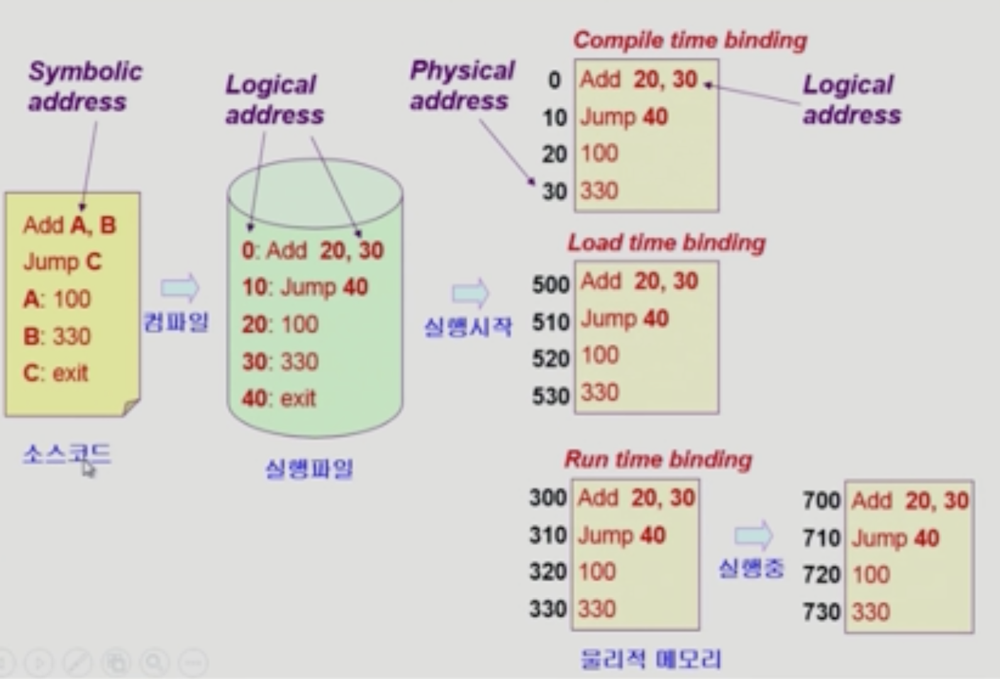

# Memory Management

## Logical vs. Physical Address

### Logical address (=vitual address)
- 프로세스마다 가상 메모리의 주소가 존재함
- 프로세스마다 독립적으로 가지는 주소 공간
- 각 프로세스마다 0번지부터 시작
- CPU가 보는 주소는 logical address임

### Physical address
- 메모리에 실제 올라가는 위치

## 주소 바인딩 (Address Binding)
- 주소 바인딩
  - 주소를 결정하는 것
  - Symbolic Address -> Logical Address -> Physical address
    - Symbolic Address: 프로그래머가 메모리 주소를 변수로 활용하는 것
  - 논리적인 주소를 물리적인 주소로 변환하는 것이 필요함
  - 운영체제가 아닌 하드웨어가 진행함

### Complie time binding
- 물리적 메모리 주소(physical address)가 컴파일 시 알려짐
- 시작 위치 변경 시 재컴파일
- 컴파일러는 절대 코드(absolute code) 생성

### Load time binding
- 프로그램을 실행시키는 시점에 가상 메모리 주소가 물리적인 메모리 주소로 바뀜
- 실행시작되는 시점에 물리적인 주소가 매겨지고, 바뀌지 않음
- Loader의 책임하에 물리적 메모리 주소 부여
- 컴파일러가 재배치가능코드(relocatable code)를 생성한 경우 가능
  - 물리적인 메모리가 바뀔 수 있는 코드

### Run time binding (=Execution time binding)
- 프로그램이 시작될 때 물리적인 메모리 주소가 매겨짐
- 프로그램 수행 중에도 메모리 상 위치를 옮길 수 있음
- CPU가 주소를 참조할 때마다 Binding를 점검 (address mapping table)
- 하드웨어적인 지원이 필요(base and limit registers, MMU)