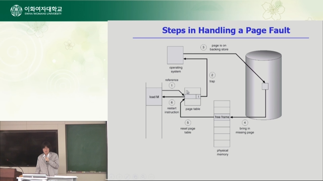
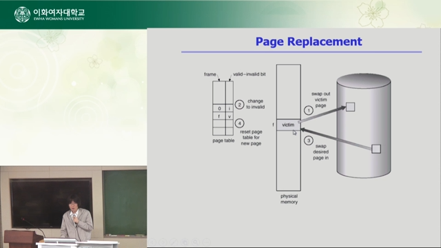
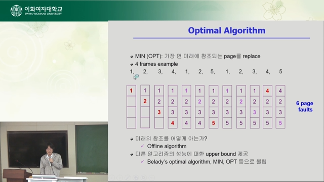
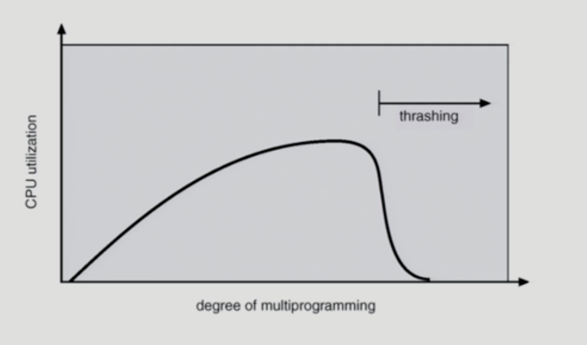
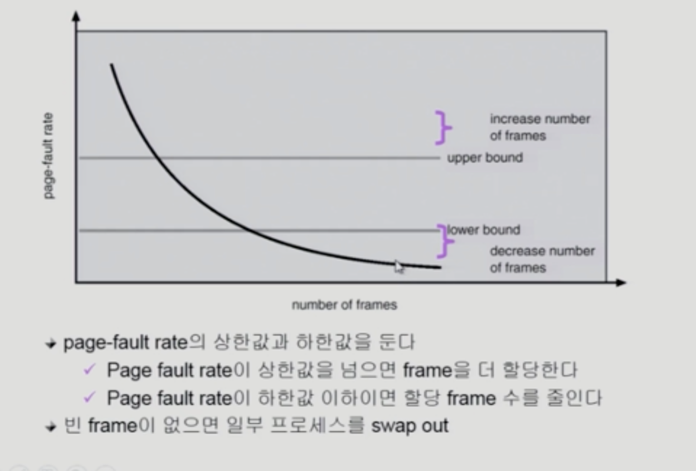

# Virtual Memory
- 페이징 기법을 사용하는 것으로 가정함
## Demand Paging
- 실제로 필요할 때 Page를 메모리에 올리는 것
  - I/O양의 감소
  - 물리적인 메모리 사용량 감소
  - 빠른 응답 시간
  - 더 많은 사용자 수용
- Valid/Invalid bit 사용
  - Invalid의 의미
    - 사용되지 않는 주소 영역인 경우
    - 페이지가 물리적 메모리에 없는 경우
  - 처음에는 모든 page entry가 invalid로 초기화
  - address translation 시에 Invalid bit가 set되어있으면 -> Page fault
    - 요청한 페이지가 메모리에 없음
    - 일종의 소프트웨어 인터럽트
### Page Fault
- invalid page를 접근하면 MMU가 Trap을 발생시킴
- kernel mode로 들어가서 page fault handler가 Invoke

- 대부분의 경우 page fault가 발생하지 않음
- 그러나 한번 page fault가 발생하면 엄청난 시간 소모 -> CPU preempt
- Page replacement
  - 어떤 frame을 빼앗아올지 결정
  - Replacement Algorithm
    - Page Fault Rate을 최소화하도록 해야함
    - 

#### Optimal Algorithm
- 가장 좋은 알고리즘
- 가장 먼 미래에 참조되는 Page를 replace
- 실제 시스템에서 사용하기는 불가능
- 

#### FIFO (First In First Out) Algorithm
- 먼저 들어온 것을 먼저 내쫓음
- FIFO Anomaly (Belady's Anomaly)
  - 더 많은 프레임을 가져도(메모리가 증가하여도) page faults가 줄어드는 것은 아님

#### LRU (Least Recently Used) Algorithm
- 가장 오래 전에 사용된 것을 지움
- linked list 사용: O(1)
#### LFU (Least Frequently Used) Algorithm
- 참조 횟수가 가장 적은 페이지를 지움
- 최저 참조 횟수인 페이지가 여럿 있는 경우
  - 임의로 선정
  - 성능 향상을 위해 LRU을 사용할 수 있음
- linked list 사용 불가, Tree: O(log n)

#### 다양한 캐슁 환경
- 캐슁 기법
  - 한정된 빠른 공간에 요청된 데이터를 저장해 두었다가 후속 요청시 캐쉬로부터 직접 서비스하는 방식
  - paging system 외에도 cache memory, buffer caching, web caching등 다양한 분야에서 사용
- 캐쉬 운영의 시간 제약
  - 교체 알고리즘에서 삭제할 항목을 결정하는 일에 지나치게 많은 시간이 걸리는 경우 실제 시스템에서 상요할 수 없음
  - buffer caching, web caching
    - O(1) ~ O(log n)
  - paging system
    - 페이징 시스템에서 LRU, LFU 사용 불가
    - 페이지가 이미 메모리에 존재할 경우, OS는 사용 시간을 알 수 없음
    - page fault가 발생한 경우에만 OS가 관여 가능

#### Clock Algorithm
- Second chance algorithm
- NUR (Not Used Recently), NRU (Not Recently Used)
- LRU의 근사 알고리즘
- Reference bit을 사용하여 해당 페이지가 최근에 사용되었는지를 표기
- 주소 변환을 하는 하드웨어가 bit를 1로 변경함
- 실제 구현은 circular linked list
- 1인 bit는 0으로 변경 후 pass
- 0인 bit를 만나면 Replace
- 개선
  - modified bit: 쓰기가 발생한 경우 변경
  - 쫓아내기 전에 수정된 사항을 반영 후 replace

### Page Frame의 Allocation
- 프로세스에 미리 페이지를 할당함
- 각 프로세스에 얼만큼의 페이지 프레임을 할당할 것인가?
- Allocation의 필요성
  - Loop를 구성하는 페이지들은 한번에 allocate 되는 것이 유리
  - allocation이 없으면 매 루프마다 page fault 발생
  - 명령어 수행을 위해 최소한 할당되어야 하는 frame 있음
- Allocation Scheme
  - Equel allocation: 똑같은 개수 할당
  - Proportional allocation: 프로세스 크기에 비례 할당
  - Priority allocation: 우선순위에 따라 할당

### Global vs. Local Replacement
- Global Replacement
  - allocation 하지 않음
  - 자동 할당
  - 메모리를 많이 사용하는 프로세스가 많은 페이지 프레임을 사용
- Local Replacement
  - 프로세스마다 할당된 프레임 내에서만 Replacement을 가능케 함

### Thrasing

- thrashing
  - 메모리에 너무 많은 프로세스를 동시에 올려놓아서, 각각의 프로세스가 제대로 운영을 하지 못하는 상태
  - 계속 page fault가 발생함
  - 프로세스의 원활한 수행에 필요한 최소한의 Page frame 수를 할당 받지 못한 경우에 발생함

### Working-Set Model
- Locality of reference
  - 프로세스는 특정 시간 동안 일정 페이지만을 집중적으로 참조
  - locality set: 집중적으로 참조되는 해당 페이지들의 집합
- Working-set Model
  - Working Set: locality에 기반하여 프로세스가 일정 시간 동안 원활하게 수행되기 위해 한꺼번에 메모리에 올라와 있어야하는 페이지들의 집합
  - Working Set에 포함되는 페이지들을 무조건 메모리에 보장
  - 프로세스의 working set 전체가 메모리에 올라와있어야 수행되고 그렇지 않을 경우 모든 프레임을 반납한 후 swap out(suspend)
  - Thrashing 방지

#### Working-Set Algorithm
- working set의 결정
  - working set window를 통해 알아냄
  - Time interval 사이에 참조된 서로 다른 페이지의 집합
  - working set에 속한 페이지는 메모리에 유지, 속하지 않은 것은 버림

### PFF (Page-Fault Frequency) Scheme
- 
- 메모리가 없을 경우, swap out
- Thrashing 방지

### Page Size의 결정
- page size 감소
  - 페이지 수 증가
  - 페이지 테이블 크기 증가
  - internal fragmentation 감소
  - disk transfer의 효율성 감소
  - 필요한 정보만 메모리에 올라와 메모리 이용이 효율적
    - locality 활용성에서는 좋지 않음
- 추세는 larger page size