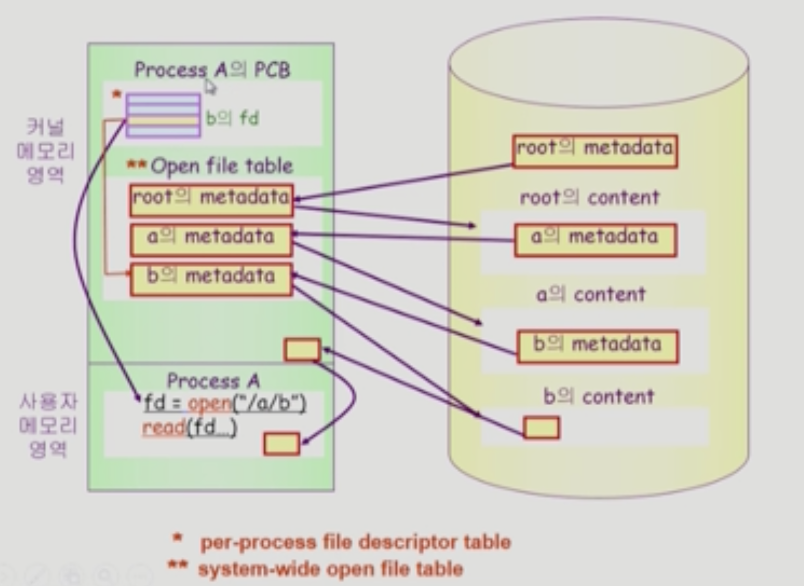

# File System
## File and File System
- File
  - a named collection of related information
  - 이름을 통해서 접근
  - 비휘발성의 보조기억장치에 저장
  - 운영체제는 다양한 저장 장치를 파일이라는 동일한 논리적 단위로 볼 수 있게 함
  - Operation
    - create, read, write, reposition(seek), delete, open, close
- File attribute (= metadata)
  - 파일 자체의 내용이 아니라 파일을 관리하기 위한 각종 정보들
  - 파일 이름, 유형, 저장된 위치, 파일 사이즈
  - 접근 권한(읽기/쓰기/실행), 시간(생성/변경/사용), 소유자
- File system
  - 운영체제에서 파일을 관리하는 부분
  - 파일 및 파일의 메타데이터, 디렉토리 정보 등을 관리
  - 파일의 저장 방법 결정
  - 파일 보호 등

## Directory and Logical Disk
- Directory
  - 파일의 메타데이터 중 일부를 보관하는 있는 일종의 특별한 파일
  - 디렉토리에 속한 파일 이름 및 파일 attribute
  - operation
    - search for a file, create a file, delete a file
    - list a directory, rename a file, traverse the file system
- Partition (= Logical Disk)
  - 하나의 (물리적)디스크 안에 여러 파티션을 두는게 일반적
  - 여러 개의 물리적인 디스크를 하나의 파티션으로 구성하기도 함
  - 디스크를 파티션으로 구성한 뒤 각각의 파티션에 file system을 깔거나 swapping 등 다른 용도로 사용할 수 있음

## open()
- retrieves metadata from disk to main memory
- 
- open("/a/b/c")
  - 디스크로부터 파일 c의 메타데이터를 메모리로 가지고 옴

## File Protection
- 각 파일에 대해 누구에게 어떤 유형의 접근을 허락할 것인가
- Access Control 방법
  - Access Control Matrix
    - matrix로 표시할 경우 공간 낭비 -> Linked list 형식 제안
    - Access control list: 파일 별로 누구에게 어떤 접근 권한이 있는지 표시
    - Capability: 사용자 별로 자신이 접근 권한을 가진 파일 및 해당 권한 표시
  - Grouping
    - 전체 User를 Owner, Group, Public 3 그룹으로 표시
    - 각 파일에 대해 세 그룹의 접근 권한(rwx)을 3비트씩으로 표시
    - (예) rwxr--r--
  - Password
    - 파일마다 Password를 두는 방법
    - 모든 접근 권한에 대해 하나의 password: all-or-nothing
    - 접근 권한별 password: 암기 문제, 관리 문제 존재
  
## File System의 Mounting
- 서로 다른 파일 시스템끼리도 접근 가능

## Access Methods
- 순차 접근 (Sequential access)
  - 카세트 테이트를 사용하는 방식처럼 접근
  - 읽거나 쓰면 Offset 자동 증가
- 직접 접근 (direct access, random access)
  - LP 레코드 판
  - 파일을 구성하는 레코드를 임의의 순서로 접근할 수 있음