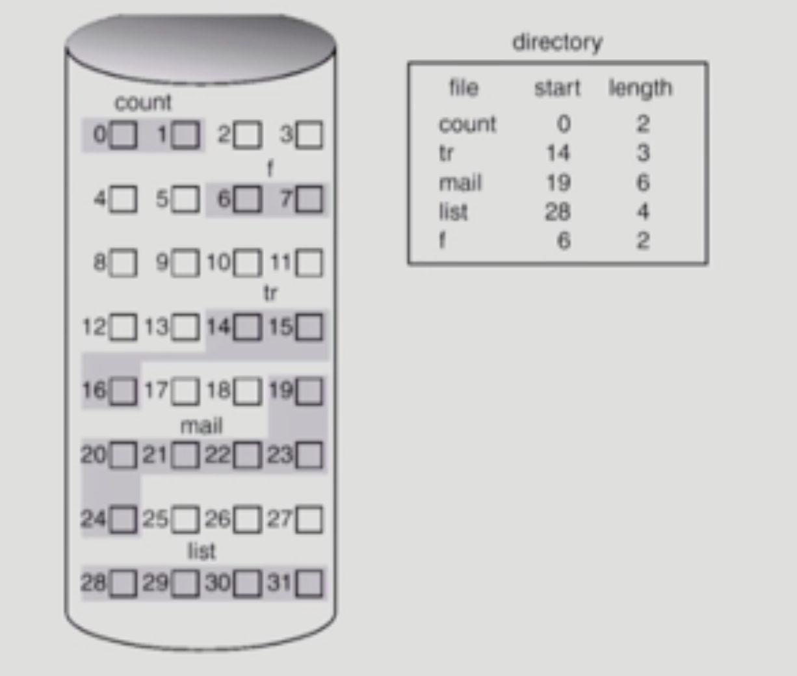
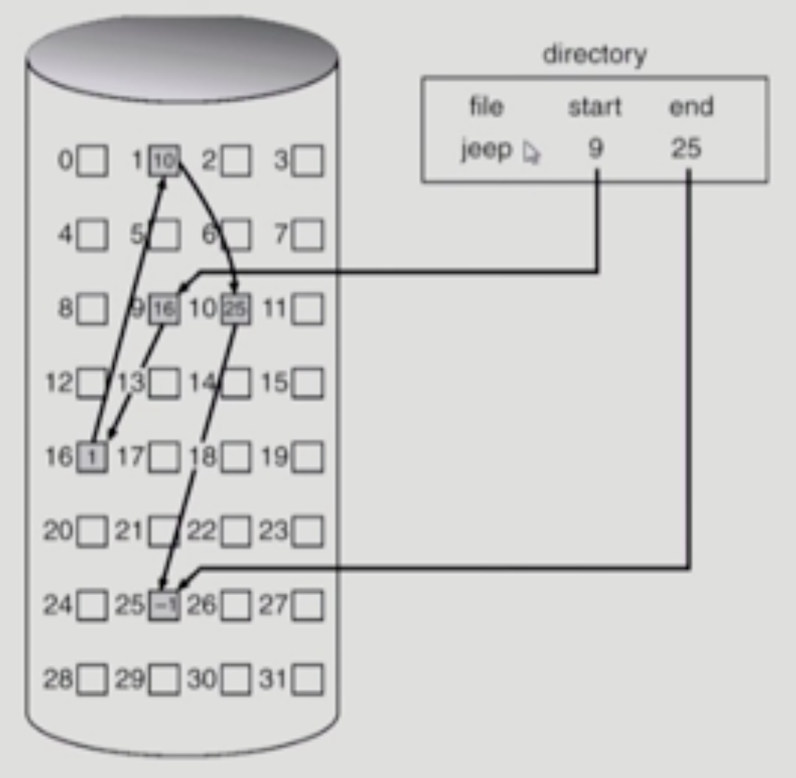
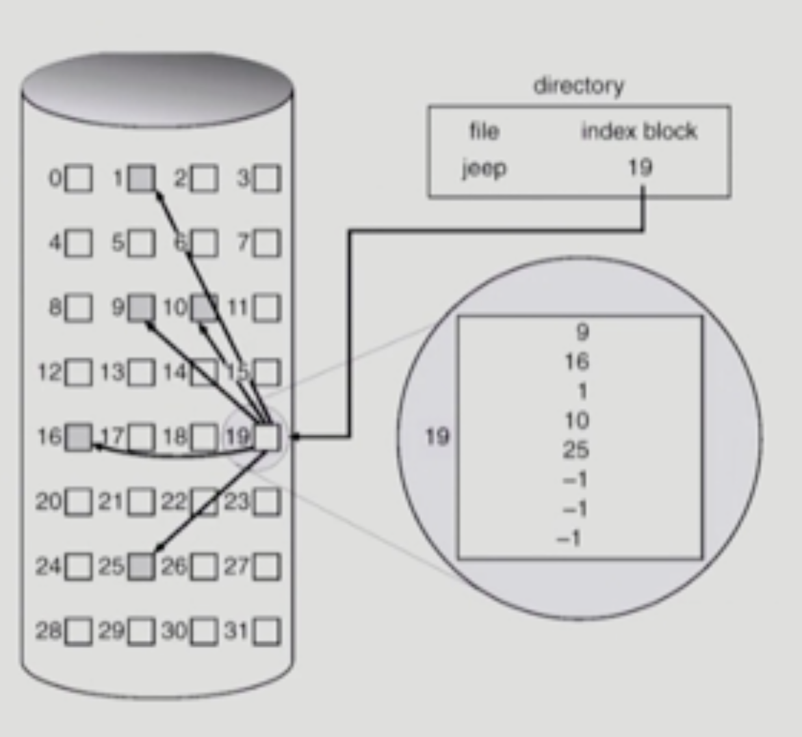
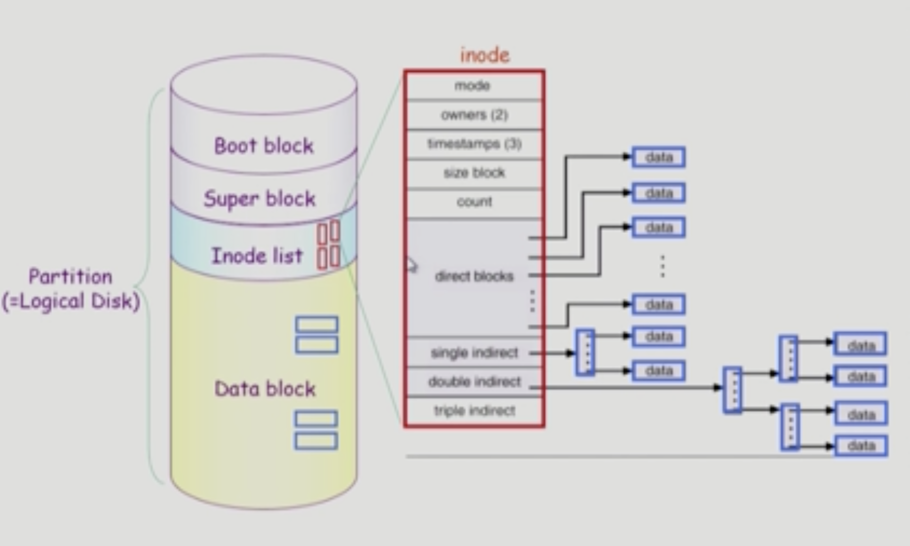
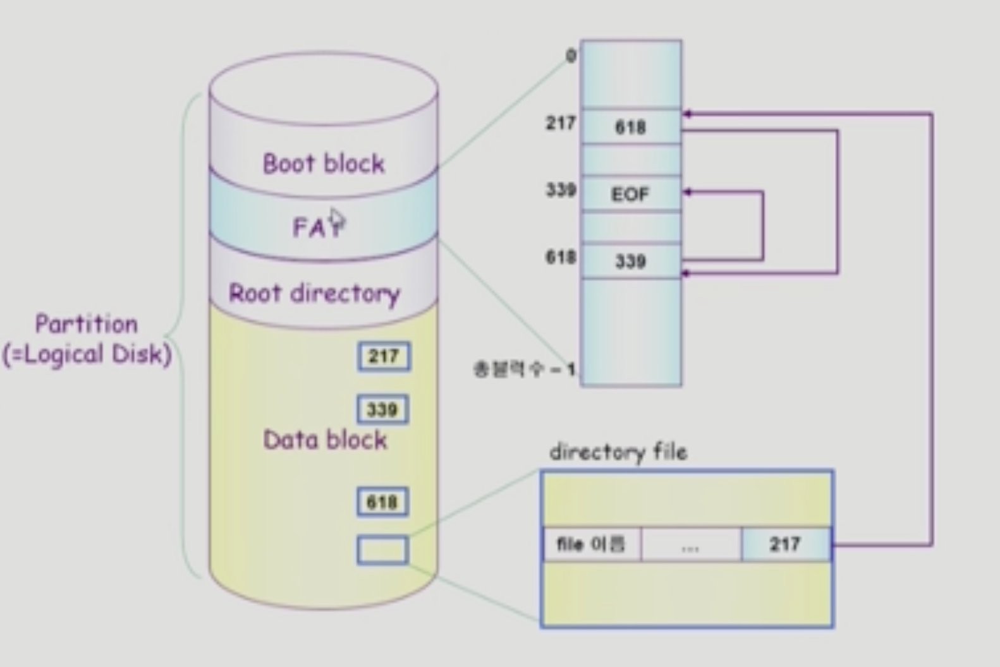
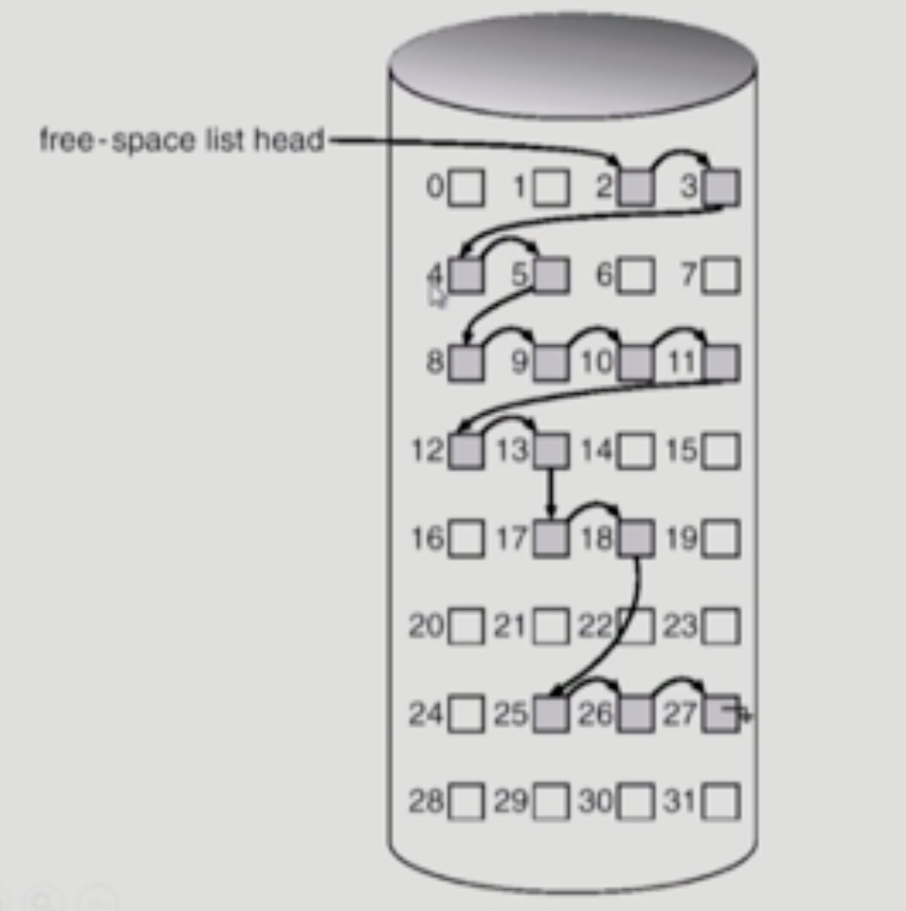
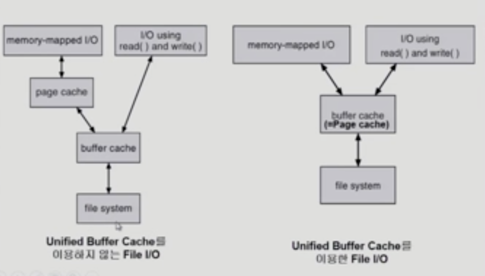
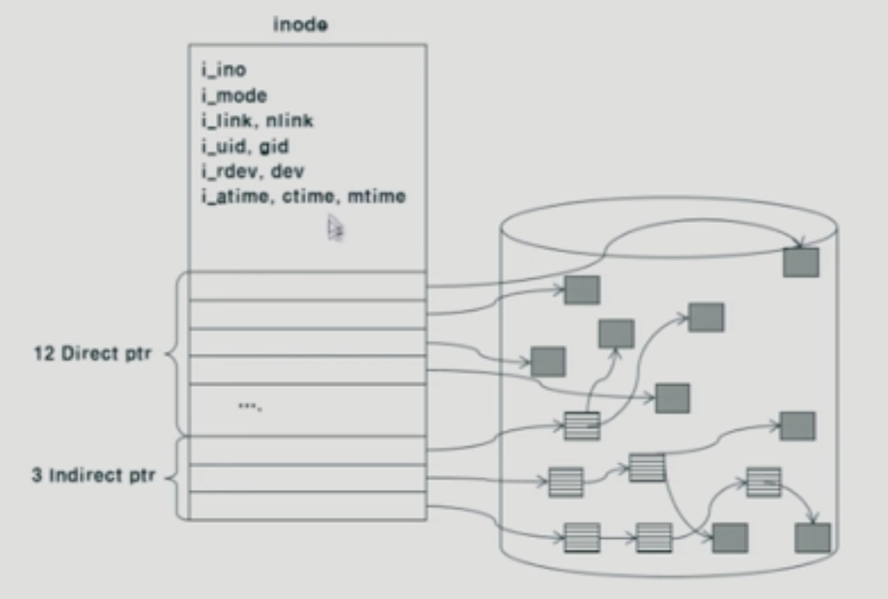

# File System Implementation
## Allocation of File Data in Disk
- 디스크에 파일 데이터를 저장하는 방법
- 저장단위: 논리적인 block
### Contiguous Allocation
- 
- 하나의 파일이 디스크 상 연속되어서 저장되는 것
- 장점
  - Fast I/O
    - 연속 할당이므로 한번의 seek/rotation으로 많은 바이트 transfer
    - realtime file 용으로 또는 이미 run 중이던 프로세스의 swapping용
  - direct access(=random access)가능
- 단점
  - Exteral fragmentation
  - file grow가 어려움
    - 파일 크기를 증가시키는 데에 어려움이 존재함
    - File 생성 시 얼마나 큰 hole을 배당할 것인가
    - Grow 가능 vs 낭비 (internal fragmentation)
### Linked Allocation
- 
- 파일의 시작위치만 디렉토리가 가지고 있음
- 장점
  - external fragmentation이 발생하지 않음
- 단점
  - no random access, 직접 접근이 불가능함
  - reliability 문제
    - 한 sector가 고장나 Pointer가 유실되면 많은 부분을 잃음
  - pointer를 위한 공간이 block의 일부가 되어 공간 효율성을 떨어뜨림
    - 512bytes/sector, 4bytes/pointer
- FAT(File-Allocation-Table) 파일 시스템
  - 포인터를 별도의 위치에 보관하여 reliability와 공간효율성 문제 해결

### Indexed Allocation
- 
- 파일이 어디에 저장되어있는 지를 한 블럭에 모두 저장해놓는 것
- 장점
  - External fragmentation 발생하지 않음
  - Direct access 가능
- 단점
  - small file의 경우 공간 낭비
  - too large file의 경우 하나의 block으로 index를 저장하기에 부족
    - 해결 방안
      - 1. linked scheme
      - 2. multi-level index

## UNIX 파일 시스템의 구조
- 
- Indexed Allocation을 변형하여 사용함
- Boot block
  - 어떤 파일 시스템이던 boot block이 가장 앞에 위치함
  - 부팅에 필요한 정보(Bootstrap loader)
- Super block
  - 파일 시스템에 관한 총체적인 정보를 담음
- Inode
  - 파일의 메타데이터를 보관함
  - 파일 하나 당 inode 하나씩 할당됨
  - 파일 이름을 제외한 파일의 모든 메타 데이터를 저장 
- Data block
  - 파일의 실제 내용을 보관
  - 파일 이름 + 인덱스 번호

## FAT File System
- 
- FAT
  - 위치정보를 저장
  - data block의 개수만큼 존재
  - 직접 접근을 가능하게 함
    - Block를 보지 않아도, FAT만 조회하여 접근할 수 있으므로 
- Data block
  - 파일 이름 + block index

## Free-Space Management
- Bit map or bit vector
  - Bit map은 부가적인 공간을 필요로 함
  - 연속적인 n개의 Free block을 찾는데 효과적
- Linked list
  - 
  - 모든 free block들을 링크로 연결
  - 연속적인 가용공간을 찾는 것이 어려움
  - 공간의 낭비가 없음
- Grouping
  - Linked list 방법의 변형
  - 첫번째 Free block이 n개의 pointer를 가짐
- Counting
  - 프로그램들이 종종 여러 개의 연속적인 블럭을 할당하고 반납한다는 성질에서 착안

## Directory Implementation
- linear list
  - <file name, file의 Metadata>
  - 구현이 간단
  - 디렉토리 내에 파일을 찾기 위해서는 linear search 필요
- hash table
  - linear list + hashing
  - hash table은 file name을 이 파일을 Linear list의 위치로 바꾸어줌
  - search time을 없앰
  - collision 발생 가능
- File의 metadata 보관 위치
  - 디렉토리 내에 직접 보관
  - 디렉토리에는 포인터를 두고 다른 곳에 보관
    - inode, FAT
- Long file name의 지원
  - 대부분의 메타데이터의 길이는 한정적임
  - 파일 이름이 고정 크기의 엔트리 길이보다 길어지는 경우, 엔트리의 마지막 부분에 이름의 뒷부분이 위치한 곳의 포인터를 두는 방법
  - 이름의 나머지 부분은 동일한 디렉토리 파일의 일부에 존재
## VFS and NFS
- Virtual File System (VFS)
  - 서로 다른 다양한 파일 시스템에 대해 동일한 시스템 콜 인터페이스를 통해 접근할 수 있게 해주는 OS의 layer
- Network File System (NFS)
  - 분산 시스템에서는 네트워크를 통해 파일이 공유될 수 있음
  - 분산 환경에서의 대표적인 파일 공유 방법

## Page Cache and Buffer Cache
- Page Cache
  - 가상 메모리의 페이징 시스템에서 사용하는 페이지 프레임을 캐슁의 관점에서 설명하는 용어
- Memory-Mapped I/O
  - 파일의 일부를 가상 메모리에 매핑시킴
  - 매핑시킨 영역에 대한 메모리 접근 연산은 파일의 입출력을 수행하게 함
- buffer cache
  - 사용자가 요청한 파일을 버리지 않고 보관하고 있다가, 동일 파일에 대한 요청이 올 경우 버퍼 캐시에서 더 빠르게 전달함
  - 파일 입출력을 빠르게 하기 위함임
  - Replacement algorithm 필요
- Unified Buffer Cache
  - buffer cache와 page cache를 통합
  - 

## 프로그램의 실행
- 가상 메모리의 Stack, data는 사용하지 않는 부분은 swap area에 존재
- 파일에 접근할때 Read, write 시스템 콜을 사용하거나 Memory-mapped i/o를 사용할 수 있음
  -  Memory-mapped i/o: 한번 매핑을 해놓으면 시스템 콜을 여러번 수행하지 않아도 된다. 효율성 증대. but, 일관성 문제 존재

## Ext2 파일 시스템
- 
- 블록의 그룹화
  - 메타데이터와 실제데이터를 인접하게 배치
  - 디스크의 탐색 시간 감소
  - 각각의 그룹 내에 메타 데이터와 실제 데이터를 함께 배치
- 수퍼블록의 중복저장
  - 각 그룹마다 수퍼블록을 중복저장하여 디스크 오류에 대비할 수 있게함
  - 신뢰성 증가
- Group descriptor
  - 그룹에 대한 전체적인 정보
  - 데이터블록 비트맵의 시작위치, 아이노드 비트맵의 시작위치