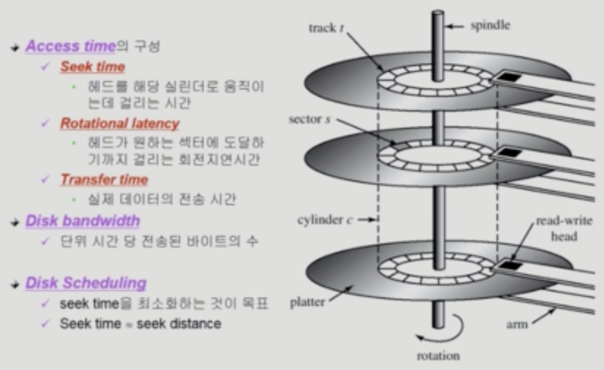

# Disk Management and Scheduling
## Disk Structure
- logical block
  - 디스크의 외부에서 보는 디스크의 단위 정보 저장 공간
  - 정보를 전송하는 최소 단위
  - 주소를 가진 1차원 배열처럼 취급
- sector
  - Logical block이 물리적인 디스크에 매핑된 위치
  - Sector 0은 최외곽 실린더의 첫 트랙에 있는 첫 번째 섹터

## Disk Management
- physical formatting (low-level formatting)
  - 디스크를 컨트롤러가 읽고 쓸 수 있도록 섹터들로 나누는 과정
  - 각 섹터는 header + data + trailer 로 구성
  - header와 Trailer는 sector number, ECC(Error-Correcting Code)등의 정보 저장, controller가 직접 접근 및 운영
- partitioning
  - 디스크를 하나 이상의 실린더 그룹으로 나누는 과정
  - 운영체제는 독립적 디스크로 취급함
- logical formatting
  - 파일시스템을 만드는 것
  - FAT, inode, free space 등의 구조
- booting
  - ROM에 있는 small bootstrap loader의 실행
  - 디스크의 sector 0을 Load하여 실행
  - sector 0은 Full bootstrap loader program

## Disk Scheduling
- 
- access time
  - seek time
    - 가장 많은 시간 차지
    - 헤드를 해당 실린더로 움직이는데 걸리는 시간
  - rotational latency
    - 헤드가 원하는 섹터에 도달하기까지 걸리는 회전지연시간
  - transfer time
    - 실제 데이터의 전송 시간
- disk bandwidth
  - 단위 시간 당 전송된 바이트의 수
- disk scheduling
  - seek time을 최소화하는 것이 목표
  - seek time은 seek distance와 근사

## Disk Scheduling Algorithm
### FCFS (First Come First Served)
- 먼저 들어온 순서대로 처리

### SSTF (Shortest Seek Time First)
- seek time이 제일 짧은 위치를 먼저
- starvation 문제 존재

### SCAN
- disk arm이 디스크의 한쪽 끝에서 다른쪽 끝으로 이동하며 가는 길목에 있는 모든 요청 처리
- 문제점: 실린더 위치에 따라 대기 시간이 다름

### C-SCAN
- SCAN에 비하여 편차를 줄이기 위함
- 헤드가 한쪽 끝에서 다른쪽 끝으로 이동하며 가는 길목에 있는 모든 요청을 처리
- 다른쪽 끝에 도달했으면 요청을 처리하지 않고 곧바로 출발점으로 다시 이동
- SCAN보다 비교적 균일한 대기 시간을 제공함

### N-SCAN
- SCAN의 변형 알고리즘
- 헤드가 출발하는 시점 이후에 발생한 요청에 대해서는 처리하지 않음
- 대기 시간의 편차를 줄이기 위함

### LOOK and C-LOOK
- 헤드가 진행 중이다가 그 방향에 더 이상 기다리는 요청이 없으면 헤드의 이동방향을 반대로 이동함

### 결정
- 파일의 할당 방법에 따라 디스크 요청이 영향을 받음
- 파일의 특성에 따라 디스크 스케쥴링 알고리즘을 다르게 사용

## Swap-Space Management
- Disk를 사용하는 2가지 이유
  - 1. memory의 Volatile -> file system
  - 2. 프로그램 실행을 위한 메모리 공간 부족 -> swap space
- swap-space
  - 가상 메모리 시스템에서는 디스크를 메모리의 연장 공간으로 사용
  - 파일시스템 내부에 둘 수도 있으나 별도 파티션 사용이 일반적
    - 공간효율성보다는 속도효율성이 우선
    - 일반 파일보다 훨씬 짧은 시간만 존재하고 자주 참조됨
    - 블록의 크기 및 저장 방식이 일반 파일시스템과 다름

## RAID
- RAID (Redundant Array of Independent Disks)
  - 여러 개의 디스크를 묶어서 사용
- RAID의 사용 목적
  - 디스크 처리 속도 향상
    - 여러 디스크에 블록의 내용을 분산 저장
    - 병렬적으로 읽어옴(interleaving, striping)
  - 신뢰성(Reliability) 향상
    - 동일 정보를 여러 디스크에 중복 저장
    - 하나의 디스크가 고장시 다른 디스크에서 읽어옴(Mirroring, shadowing)
    - 단순한 중복 저장이 아니라 일부 디스크에 parity를 저장하여 공간의 효율성을 높일 수 있음